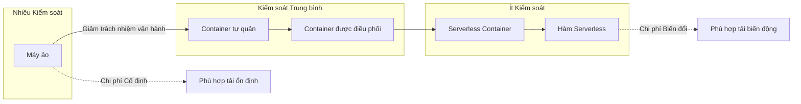

# Cloud Compute Model Decision

Choosing the right compute model for each workload is one of the architectural decisions with the greatest impact on total cost of ownership, operability, and scalability of a system. Cloud providers offer a continuous spectrum from traditional virtual machines to orchestrated containers to serverless functions — each model represents a different point on the trade-off curve between control, operational responsibility, cost model, and scaling characteristics.

## The Compute Spectrum

The cloud compute spectrum can be understood as a gradual transfer of operational responsibility from the user to the provider. At one end of the spectrum are virtual machines: the user controls the operating system, runtime, libraries, and configuration, but is responsible for patching, scaling, and maintenance. At the other end are serverless functions: the user only provides source code, and the provider handles everything else — but with constraints on execution time, resources, and customizability.

## Selection Criteria

The decision to choose a compute model should be based on four criteria, evaluated in order of priority depending on the workload characteristics.

Load characteristics are the most important criterion. Stable, predictable workloads — such as internal APIs with constant throughput throughout the day — suit the reserved capacity model of virtual machines or containers, where fixed costs are lower than variable costs at scale. Variable, unpredictable workloads — such as on-demand image processing with traffic spikes — suit serverless, where costs scale proportionally with usage and are zero when there is no traffic.

Latency requirements are the second criterion. Serverless functions have cold starts — the time to initialize a new execution environment — which can add 200ms to 2 seconds to the first request. For user-facing APIs requiring sub-100ms latency, cold starts are unacceptable without provisioned concurrency — a feature that keeps execution environments warm at additional cost. Containers and virtual machines do not have cold starts but have longer startup times when scaling.

Execution time is the third criterion. Serverless functions have a maximum execution time limit — typically 15 minutes. Workloads for video processing, model training, or large-scale data migration require longer execution times and must run on containers or virtual machines. The time limit is not a defect of serverless — it is a mechanism that enforces design toward short, stateless tasks.

Specialized resource requirements are the fourth criterion. Workloads requiring GPUs, large memory, fast local storage, or specialized hardware cannot run on standard serverless functions. They require virtual machines or containers with the ability to attach specialized resources.

## Hybrid Strategy

In practice, most production systems use multiple compute models for different components. User-facing APIs with low-latency requirements run on orchestrated containers with autoscaling. Asynchronous background job processing — such as thumbnail generation, email sending, webhook processing — runs on serverless functions. Databases and stateful storage systems run on virtual machines with reserved capacity. Big data processing pipelines run on container clusters with batch scaling capability.

A hybrid architecture is not a sign of indecision — it is a sign of design maturity, where each component uses the compute model optimal for its specific characteristics.

## Selection Principles

Compute model selection is based on three principles. First, start with the simplest model that meets the requirements — do not choose orchestrated containers if a simple virtual machine is sufficient. Second, model costs at target scale, not at current scale — serverless may be cheaper at 100 requests per day but significantly more expensive at 10 million requests per day. Third, portability between models should be designed from the start — containerize applications even if you plan to run on virtual machines, as this enables switching compute models later without rewriting the application.
