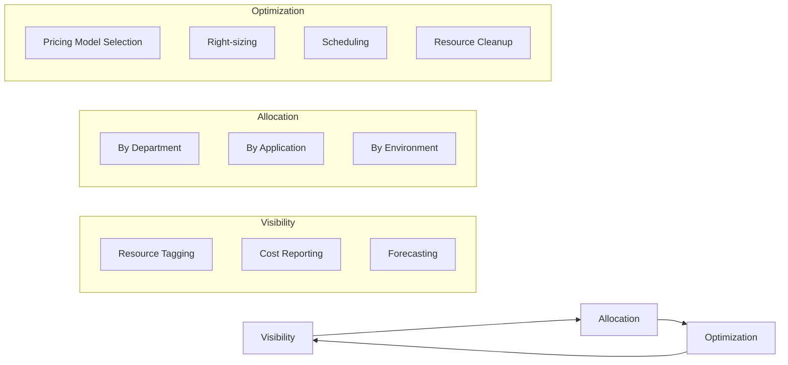

# Cloud FinOps Fundamentals

FinOps is a cloud cost management methodology that brings together finance, engineering, and operations. It transforms cloud costs from a surprise that appears on the monthly bill into a predictable, allocable, and optimizable business metric. In cloud environments, where resources can be provisioned in seconds and costs accrue by the hour, cost management is not an after-the-fact activity — it is an engineering discipline that must be integrated into the development workflow.

## The Three Pillars of FinOps

### Cost Visibility

You cannot manage what you cannot see. The first pillar is building comprehensive cost visibility: who is spending, on what, and why. This requires a systematic resource tagging strategy, where every cloud resource — virtual machines, databases, storage buckets, serverless functions — is tagged with information about owner, application, environment, and cost center.

Tagging is not optional. Without tags, the cloud bill is an unanalyzable monolith — you know the total cost but not which department, which application, or which feature is consuming it. Tagging policies must be enforced automatically: resources lacking mandatory tags should be blocked from creation, or at minimum flagged and reported.

### Cost Allocation

Once costs are visible, the next step is allocating them to the actual consuming units. Allocation can be by department (each department pays for its own resources), by application (each application has its own budget), by environment (production, staging, development), or by customer (for multi-tenant platforms).

Chargeback — actually billing departments based on their usage — creates the strongest financial accountability but also demands the highest accuracy in allocation. Showback — displaying costs without actually charging — is easier to implement and still creates pressure for improvement through transparency.

### Cost Optimization

Optimization is not about cutting — it is about ensuring every dollar spent generates proportional value. Optimization levers include: choosing the right pricing model (reserved capacity for stable workloads, spot capacity for flexible workloads, on-demand for variable workloads), right-sizing resources (eliminating over-provisioned resources), scheduling non-production resources to shut down outside business hours, and cleaning up unused resources (unassigned IP addresses, unattached disks, old snapshots).

## FinOps Culture

FinOps is not the responsibility of a single team — it is a cross-functional culture. Engineers make architectural decisions that affect cost. Finance provides budgets and forecasts. Leadership sets priorities and trade-offs. Without the participation of all three groups, FinOps becomes a reporting exercise that produces no real change.

The core principle of FinOps culture is that cost is an engineering metric, not a purely financial concern. Every engineer should be able to see the cost of the resources they manage, understand the available optimization levers, and be empowered to make optimization changes within their scope of responsibility.

## Design Principles

Cloud FinOps rests on three principles. First, cost must be visible in real time or near real time — cost reporting with a one-month lag is useless for engineering decision-making. Second, cost responsibility must be distributed — every team owns the cost of the resources they create, and has the control to optimize them. Third, optimization is continuous, not a one-time project — cloud environments change constantly, and new optimization opportunities emerge as workloads evolve and new pricing models are introduced.
