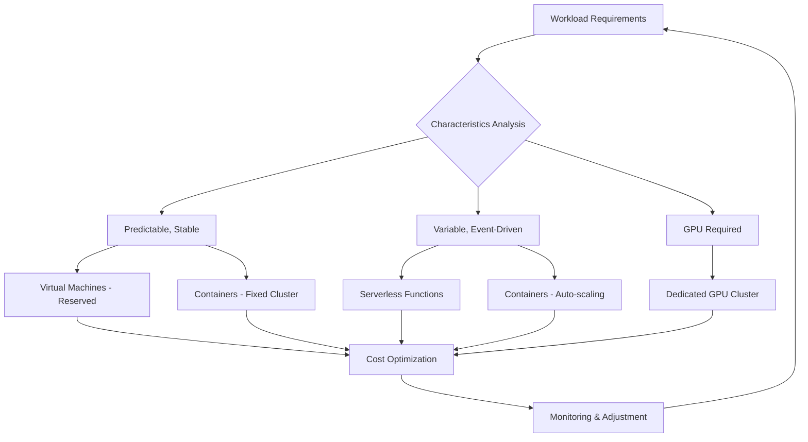
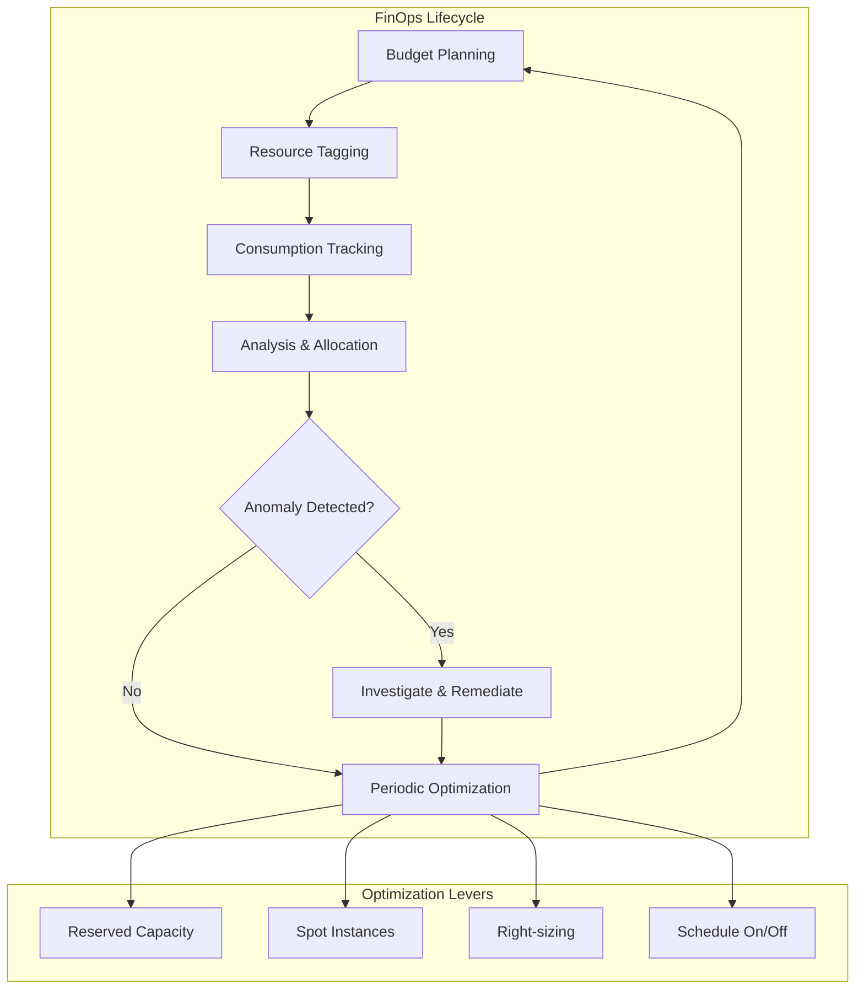

# Cloud Infrastructure Engineering

Cloud computing has transformed from a cost-saving experiment into the default operating model for modern software. However, operating in the cloud and architecting for the cloud are two fundamentally different activities. Cloud infrastructure engineering is the discipline of designing, deploying, and operating systems that fully exploit the capabilities of distributed computing environments — not merely relocating virtual machines to third-party data centers.

## The Essence of Cloud Engineering

Cloud engineering sits at the intersection of software architecture and infrastructure operations. It means applying engineering rigor to cloud resources: treating infrastructure as code, designing for failure, optimizing for both cost and performance simultaneously, and building systems that span multiple providers when the use case demands it.

A cloud engineer must simultaneously address four dimensions. Architecture — not just which services to use, but how they compose into resilient, observable, cost-efficient systems. Automation — manual console operations do not scale; infrastructure must be defined through code, deployed through CI/CD pipelines, and protected by automated policies. Economics — the cloud bill is a design constraint; every architectural decision carries a monetary value. Governance — multi-account strategies, identity federation, and compliance guardrails form the foundation for all enterprise-scale operations.

## Core Knowledge Pillars

### Compute Infrastructure Services

Major cloud providers offer a continuous spectrum of compute models, from traditional virtual machines providing full control, to container orchestration platforms managing application lifecycles, to serverless functions running event-driven with per-invocation billing. Each model sits at an optimal position on the trade-off curve between control, cost, latency, and scalability. Selecting the right compute model for each workload is one of the architectural decisions with the greatest impact on total cost of ownership.

### Networking and Connectivity

Cloud networking is software-defined — and when misconfigured, it can be wide open to the internet. Network design in cloud environments revolves around the Virtual Private Cloud model, where resources are partitioned into public and private subnets with tightly controlled access policies. Security groups act as virtual firewalls at the instance level; Network ACLs provide additional control at the subnet level. Private connectivity mechanisms — such as VPC endpoints and PrivateLink — keep data traffic from ever touching the public internet. Transit Gateway provides a hub-and-spoke model for connecting hundreds of VPCs without complex peer-to-peer network meshes.

### Identity and Access Management

In the cloud, identity is the security perimeter. There is no physical firewall or location-based access control — the question is not "which network can reach this resource" but "which identity has permission to perform this action on this resource." Role-based access control, least-privilege policies, permission boundaries, and Service Control Policies form a multi-layered defense system. Misconfigured access policies are the root cause of the vast majority of cloud security incidents.

### Multi-Account Strategy

Cloud accounts are the strongest isolation boundary. A well-designed Landing Zone groups accounts into Organizational Units that reflect the actual operating model: centralized security accounts, shared infrastructure accounts, workload accounts for each environment and application, and sandbox accounts for experimentation. Service Control Policies apply at the organizational level to enforce rules that cannot be overridden. Identity federation connects to the enterprise identity system so users authenticate with corporate credentials and receive temporary access.

### Cloud Economics and FinOps

Cloud cost is not an after-the-fact concern — it is a design constraint on par with latency and throughput. FinOps is the methodology that transforms cloud costs from a monthly surprise into a predictable and optimizable business metric. Mechanisms include flexible pricing models (reserved capacity, savings plans, spot instances), resource tagging strategies for cost allocation, budget alerts, and detailed bill analysis. Cost optimization is not about cutting — it is about ensuring every dollar spent generates proportional value.

### Multi-Cloud Strategy

Operating across multiple cloud providers — once a consequence of mergers and acquisitions — has now become a deliberate strategy to avoid single-provider dependency, optimize costs through arbitrage, meet data sovereignty requirements, and leverage each platform's unique strengths. However, multi-cloud done wrong multiplies complexity faster than it adds value. Infrastructure-as-code tools operating across providers, service meshes extending across cloud boundaries, and cloud-agnostic design patterns help balance portability with the ability to leverage native services.

### Migration and Modernization

Migrating workloads to the cloud is not a purely technical exercise — it is an organizational transformation disguised as an infrastructure project. Migration strategies — rehost, refactor, rearchitect, rebuild, replace — form a spectrum from fast-cheap-no-change to slow-expensive-comprehensive modernization. Proper assessment of the current state, phased migration planning with rollback capability, and post-migration optimization are three essential stages.

## Core Principles

Cloud engineering rests on three foundational principles. First, infrastructure is code — every resource must be defined, tested, and deployed through automated pipelines, not manual operations. Second, design for failure — assume every component can and will fail, and build systems that degrade gracefully rather than collapse catastrophically. Third, cost is architecture — every design decision must be evaluated not only technically but also economically, with costs modeled and forecast before deployment, not discovered upon receiving the bill.
