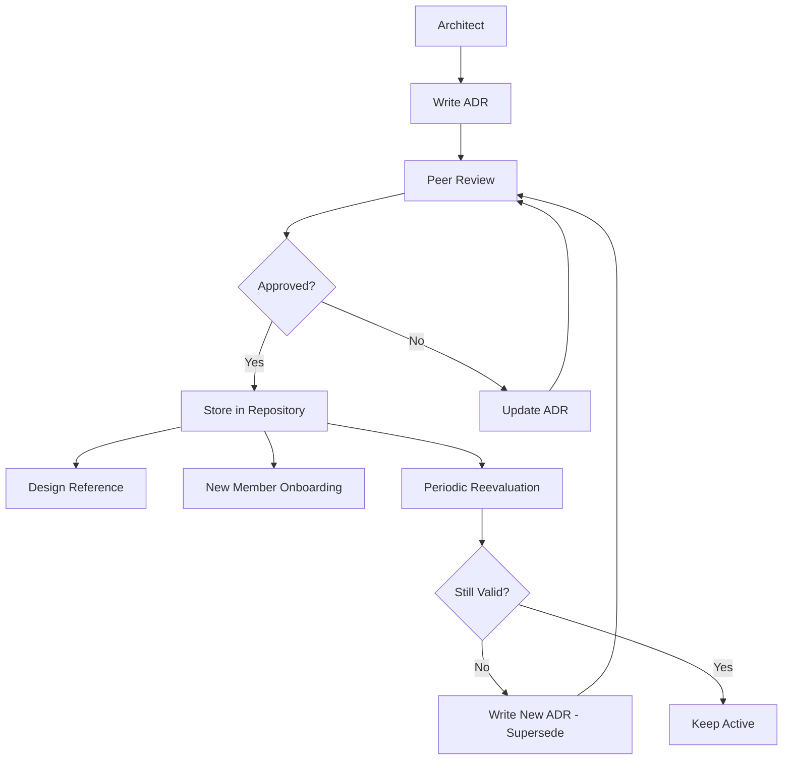

# Engineering Practices and Professional Skills

System architecture and writing code are teachable skills. How to write a persuasive design document, how to lead an effective architecture review, how to manage technical debt without slowing development velocity — these are the skills that are rarely taught but determine the difference between a good engineer and one who can lead.

## The Essence of Engineering Practices

Hard technical skills are necessary. Professional practice skills are what make them sufficient. An engineer can design a theoretically perfect distributed system, but if they cannot communicate that design to colleagues, cannot lead the review process to discover flaws, and cannot manage the deployment process to minimize risk — then that design will never reach production, or will fail when it does.

Engineering practices encompass meta-skills: how to think about problems, how to communicate decisions, how to organize work, and how to build an engineering culture within an organization. These are not "soft skills" — they have methodology, are learnable, and have measurable impact on the quality and velocity of an engineering organization.

## Core Knowledge Pillars

### Technical Communication and Documentation

Technical documentation is not a byproduct of the development process — it is part of the product. Architecture Decision Records are one of the most powerful tools for recording architectural decisions. Each ADR records the context, the decision made, the alternatives considered, and the consequences of the decision. The collection of ADRs over time forms a traceable history of why the system was built the way it is — invaluable information when new members join or when old decisions need to be reevaluated.

Operational runbooks describe standard procedures for common and emergency situations. A good runbook does not assume the reader is the person who built the system — it enables an on-call engineer at three in the morning to diagnose and resolve an incident without understanding the entire architecture. API documentation does not just list endpoints and parameters — it provides usage examples, describes common error scenarios, and explains the underlying data model.

### Review and Quality Assurance

Code review is a conversation between engineers, not just a quality gate. Research shows that review speed matters more than depth — reviews completed within 24 hours correlate with higher code quality than reviews that take a week but are more thorough. Fast reviews keep the developer's context fresh — they still understand the code they wrote and the trade-offs they made.

Architecture reviews serve a different purpose from code reviews. While code reviews focus on implementation correctness, architecture reviews focus on design appropriateness. An effective architecture review process separates reading (done before the meeting) from discussion (done during the meeting) and decision-making (recorded in the ADR). The best reviewers do not ask "is this design correct" but "what will fail" — forcing the designer to think about failure modes, not just the happy path.

### Technical Debt Management

Technical debt is the cumulative consequence of engineering decisions that prioritize speed over long-term quality. Like financial debt, it is not inherently bad — sometimes incurring technical debt to meet a critical deadline is the right business decision. But like financial debt, it must be recorded, tracked, and repaid — otherwise the compounding interest of complexity will paralyze development velocity.

A technical debt register is a living document listing all known debt items, their impact, and repayment plans. Each debt item is classified by severity: debt that blocks daily development needs immediate attention; debt that slows certain types of changes can be scheduled; debt that only affects rare scenarios can be recorded and monitored. The 20 percent rule — dedicating 20 percent of each development cycle's capacity to technical debt repayment — is a useful heuristic proven across many organizations.

### Incident Management and Postmortems

Production incidents are inevitable. How an organization responds to incidents determines whether they become learning opportunities or sources of blame. A blameless culture — where postmortems focus on improving systems rather than finding people to blame — is the foundation of reliability. An effective postmortem answers: what happened (timeline), why it happened (root cause analysis), how we detected it (monitoring), how we fixed it (response), and how we prevent it from recurring (action items).

### Engineering Career Ladders

Career development in engineering is not a straight line from developer to manager. Mature engineering organizations provide two parallel tracks: the management track (engineering manager, director) and the individual contributor track (staff engineer, principal engineer, distinguished engineer). The IC track allows engineers to grow their technical influence without transitioning to people management. Differentiating skills for each track: management requires people development, project management, and organizational communication; IC requires technical vision, complex system design, and technical mentorship.

## Core Principles

Engineering practices rest on three foundational principles. First, communication is a product — clear documentation, structured review processes, and well-written postmortems are not side work but the primary output of a mature engineering organization. Second, process serves people, not the other way around — every process must be periodically evaluated for effectiveness and adjusted or eliminated if it hinders rather than helps. Third, continuous improvement is the operating principle — a blameless culture, a technical debt register, and clear career ladders create a feedback loop where every incident and every project is an opportunity for the organization to become better.
