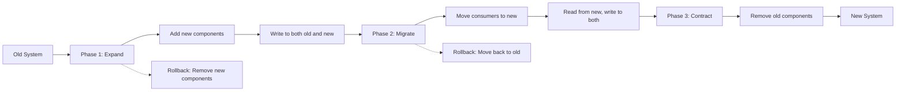

# System Migration Strategies

Migrating a system from its current state to a desired state is one of the riskiest activities in software engineering. Data must be migrated without loss or corruption. Interfaces must change without disrupting consumers. Behavior must be verified at every step. The right migration strategy is the difference between a smooth transition and a prolonged production incident.

## Migration Patterns

### Strangler Fig

The Strangler Fig pattern is inspired by the strangler fig tree in nature: the new tree grows around the old tree, gradually replacing it without ever causing it to collapse. In software, the new system is built around the old system, gradually taking over functionality. A router or proxy redirects some requests to the new system while the rest continue to the old system. As the new system proves its reliability, the proportion of redirected requests increases gradually until the old system no longer receives traffic and can be decommissioned.

The main advantage of Strangler Fig is low risk: each portion of functionality is migrated independently, and if there is a problem, only that portion is affected. The old system remains operational as a fallback. The disadvantage is time: the migration can take months as each portion of functionality is migrated sequentially.

### Parallel Run

In the Parallel Run pattern, the old system and the new system run side by side, processing the same input. The outputs of both are compared to detect discrepancies. Once the outputs are consistent over a sufficiently long period, traffic is fully switched to the new system.

Parallel Run provides the highest level of confidence — you have empirical evidence that the new system behaves identically to the old system on real data. The disadvantage is cost: you must operate both systems simultaneously, and comparison logic can be complex if outputs are not exactly identical (e.g., different timestamps, different IDs).

### Expand-Contract

Expand-Contract is a database schema migration pattern that requires no downtime. The expand phase adds new components — new columns, new tables, new API fields — while maintaining the old components. The contract phase removes the old components after all consumers have migrated to the new components.

For example: to rename a field from "phone" to "phone_number", the expand phase adds the "phone_number" field and begins writing to both fields. The contract phase — after all readers have switched to reading "phone_number" — removes the "phone" field.

## Principles of Safe Migration

Every migration step must be reversible. If something goes wrong, you must be able to return to the previous state without data loss or service disruption. Reversibility must be tested before starting the migration — an untested rollback plan is not a plan.

Migrations should be carried out in small steps, each independently verifiable. A single large, monolithic migration step is a disaster waiting to happen. Many small steps, each independently testable and rollbackable, minimize risk.

Monitoring must be enhanced during migration. Every critical metric — latency, error rate, throughput, data consistency — must be tracked more closely than usual. Any degradation should trigger alerts and potentially trigger a rollback.

## Design Principles

Migration strategy is based on three principles. First, zero downtime is the goal — every migration pattern should be designed so the system continues to serve requests throughout the process. Second, reversibility is mandatory — every step must have a tested way back. Third, migration is a process, not an event — it takes place over time, with many steps, and requires patience and discipline.
