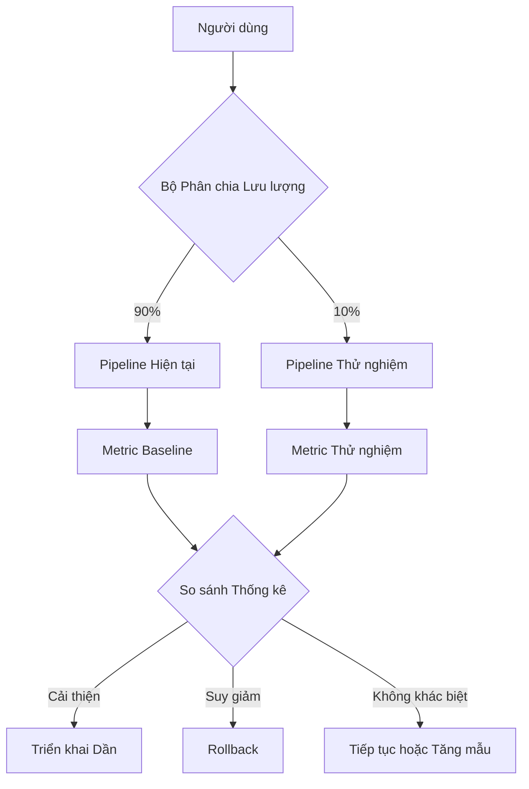

# A/B Testing for Language Model Applications

A/B testing in the context of language models presents unprecedented challenges compared to traditional A/B testing. In a typical web application, you change a button color and measure click-through rate. In a language model system, you change the prompt or the model and need to measure the impact on response quality — a multidimensional, subjective attribute that is difficult to quantify automatically.

## Types of Experiments

### Prompt A/B Test

Changing the system prompt, instruction template, or few-shot example structure. Same model, same input, but different prompts. The goal is to identify which prompt produces higher quality responses according to defined metrics.

Key challenge: prompt changes may improve one quality dimension (e.g., accuracy) while degrading another (e.g., conciseness). The deployment decision requires multidimensional evaluation and often requires human judgment on which tradeoffs are acceptable.

### Model A/B Test

Comparing two different models on the same prompt. This could be a new version of the same model, or two completely different models — for example, comparing a lightweight model with a powerful model for the same task.

Beyond quality, model A/B tests must measure cost and latency. A new model may produce higher quality responses but at triple the cost and double the latency. The deployment decision is a multi-objective optimization problem, not a simple "which is better" comparison.

### Pipeline A/B Test

Changing the entire pipeline: chunking strategy, embedding model, retrieval configuration, reranking parameters. This is the most complex type of experiment because multiple variables change simultaneously, making it difficult to attribute improvement or degradation to a specific change.

## Metrics for LLM A/B Testing

### Automated Metrics

Rejection rate — the percentage of requests the model refuses to answer. A prompt change may inadvertently increase rejection rates for legitimate queries, or decrease rejection rates for harmful queries. Both directions are problems.

Response length distribution — significant changes in average token count per response may indicate the new prompt is encouraging the model to be excessively verbose or overly concise. Response length directly correlates with cost and latency.

Schema violation rate — for applications requiring structured output, the rate of non-schema-compliant responses is the most critical quality metric. A new prompt may improve text quality but reduce schema compliance rates.

### Manual Metrics

Human evaluation is the gold standard for subjective attributes. A random sample of responses from both branches is sent to raters who score based on a predefined rubric: accuracy, relevance, helpfulness, tone, safety.

The required sample size depends on the expected effect size and statistical confidence level. For most applications, 100 to 200 evaluations per branch are sufficient to detect practically meaningful differences. Fewer and you risk drawing incorrect conclusions due to statistical noise.

## Canary Deployment

Canary deployment is a risk mitigation strategy: the change is deployed to a small fraction of traffic (typically 5 to 10 percent) and closely monitored before scaling. For language model systems, the canary should run for at least 24 hours to collect sufficient data across different usage cycles — peak hours, off-peak hours, different user types.

During the canary period, any significant degradation in automated metrics triggers an automatic rollback. Rollback thresholds should be defined in advance, not decided in the heat of the moment. For example: if error rate increases beyond 2 percent or schema violation rate increases beyond 5 percent, the system automatically shifts all traffic back to the old configuration.

## Design Principles

A/B testing for language model systems rests on three principles. First, define success metrics before starting — if you do not know what you are optimizing for, you cannot know whether the experiment succeeded. Second, use both automated metrics and human evaluation — automated metrics detect obvious problems, human evaluation detects subtle ones. Third, rollback must be automatic and rapid — a change that degrades quality affects real users, and every minute of delay in rollback is a minute of users receiving a poor experience.
