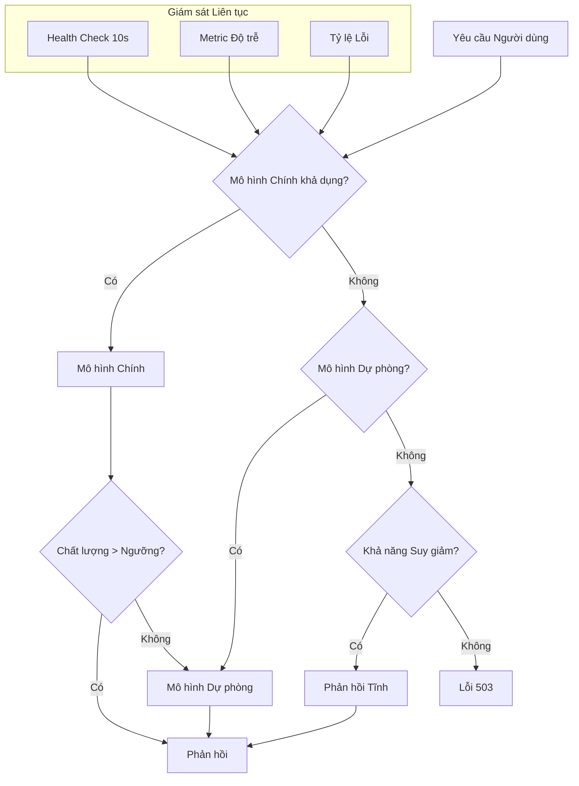

# Disaster Recovery for Language Model Systems

Language model systems in production depend on multiple components: the language model (which may be an external API or self-hosted), vector databases, document stores, embedding pipelines, and application services. Every component is a potential point of failure. Disaster recovery is the discipline of designing systems to continue operating — or recover quickly — when one or more components fail.

## Risk Analysis

Failure modes in language model systems fall into four main categories.

Model provider failure: external API is unavailable due to provider outage, scheduled maintenance, or sudden policy changes. For systems entirely dependent on a single provider, this is the largest risk with an uncontrollable recovery time.

Retrieval infrastructure failure: vector database or document store is unavailable due to hardware failure, configuration error, or overload. The system loses the ability to retrieve context — the model still functions but without domain-specific knowledge.

Inference infrastructure failure: for self-hosted systems, the GPU cluster may crash, run out of memory, or suffer resource fragmentation. For systems using APIs, network connectivity or authentication issues may prevent access.

Application failure: logic errors in the processing pipeline, excessive memory consumption, or infinite loops in agent orchestration.

## Fallback Strategies

### Multi-Provider

The strongest — and most complex — strategy. The system is designed to work with multiple language model providers. When the primary provider is unavailable, the system automatically switches to a fallback provider.

The key challenge is not technical — different providers' APIs can be wrapped in an abstraction layer — but behavioral: different models respond differently to the same prompt. A system prompt optimized for model A may produce poor results on model B. A multi-provider strategy requires maintaining separate prompts for each provider and testing them periodically — not just when an incident occurs.

### Service Degradation

When a component is unavailable and there is no fallback, the system degrades functionality in a controlled way rather than failing completely. Common degradation modes include: responding without retrieval context (relying solely on the model's intrinsic knowledge), responding with a pre-written static response ("I am currently unable to access the knowledge base. Please try again later."), or switching to a lighter, faster but less accurate model.

Controlled degradation is better than complete failure. The user receives a response — perhaps not perfect, but more useful than an error message. The key is clear communication: the response should indicate that it is operating in degraded mode so the user understands why quality is lower than normal.

### Data Backup and Recovery

Vector databases, document stores, and system configurations must be backed up periodically. Backup frequency depends on the rate of data change and Recovery Point Objective requirements. For most systems, daily backups with point-in-time recovery capability are sufficient. For systems processing highly dynamic data, continuous backup with replication may be necessary.

Equally important is recoverability: backups must be tested periodically by actually restoring them to a staging environment. A backup that has never been tested is not a backup — it is hope stored on disk.

## Recovery Testing

Untested disaster recovery is nonexistent disaster recovery. Game days — periodic exercises where components are actually disabled in staging or even controlled production environments — are the only way to verify that recovery procedures work as expected.

Game day scenarios should include: disabling the primary model provider (by blocking network traffic to their API endpoint), disabling the vector database (by stopping the service or exhausting the connection pool), simulating model quality degradation (by introducing a prompt that causes a high rejection rate), and simulating traffic spikes (by generating large numbers of concurrent requests).

## Design Principles

Disaster recovery for language model systems rests on three principles. First, no single point of failure — every critical component must have a defined fallback or degradation mode. Second, recovery must be automatic — humans cannot respond quickly enough to maintain availability in the event of sudden failure. Third, recovery testing is mandatory, not optional — an untested recovery plan is a work of fiction.
