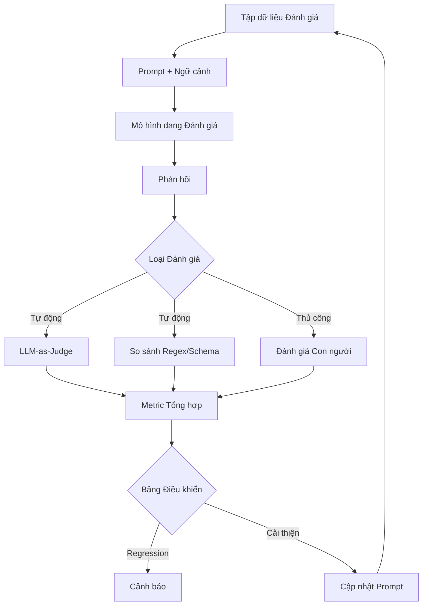

# Evaluation Pipelines for Language Model Systems

You cannot improve what you do not measure. For language model systems, evaluation is a much harder problem than for traditional software because there is no single concept of a "correct output" — the same question can have multiple valid answers, and the quality of a response is multidimensional, encompassing accuracy, relevance, tone, safety, and helpfulness.

## Evaluation Dimensions

The output quality of a language model cannot be captured by a single metric. A comprehensive evaluation framework must cover at least five dimensions.

Factual accuracy measures the extent to which the response correctly reflects information from authorized sources. For RAG systems, this means the response must be consistent with the retrieved documents. For free-generation systems, this means the response must not contain verifiably false information.

Relevance measures the extent to which the response answers the question asked. A factually accurate response that is irrelevant to the question is a failure, even though it contains no false information.

Completeness measures the extent to which the response covers all aspects of the question. A partially correct answer that misses critical information can be as misleading as an incorrect answer.

Tone and style measure the extent to which the response adheres to the desired tone — professional, friendly, empathetic, or neutral — and style — concise or detailed, technical or simple.

Safety measures the extent to which the response avoids harmful content, toxic language, dangerous misinformation, or content policy violations.

## The Golden Dataset

The golden dataset is the foundation of every evaluation pipeline. It is a set of query-expected response pairs, manually curated and labeled, reflecting the real distribution of user queries. A good golden dataset has three properties.

Representativeness: the dataset must reflect the actual distribution of queries the system receives in production, including edge cases and adversarial queries. A dataset containing only easy questions will produce artificially high scores and miss failure modes.

Diversity: the dataset must include different query types — factual questions, instructional requests, ambiguous queries, unanswerable queries — and varying levels of complexity.

Freshness: the dataset must be updated periodically to reflect new query patterns, new topics, and new failure modes discovered in production. A static dataset will gradually lose representativeness and predictive value.

## LLM-as-Judge

Using a language model to evaluate another language model's output is a powerful but risky technique. The power lies in the ability to evaluate subjective attributes — such as tone, helpfulness, and relevance — that traditional automated methods cannot measure. The risk lies in the evaluating model potentially sharing the same blind spots and biases as the model being evaluated.

To mitigate the risk, the evaluating model should be calibrated against human evaluations. A subset of the golden dataset is labeled by multiple independent human raters. The evaluating model then evaluates the same subset and its scores are compared to human scores. If there are systematic discrepancies — for example, the evaluating model consistently gives higher scores to longer responses — calibration is needed.

## Regression and Drift Detection

Evaluation is not just a development activity — it is an ongoing production activity. When prompts are updated, when models are upgraded, or when the retrieval dataset changes, the evaluation pipeline must rerun the entire golden dataset and compare results against the previous baseline. Any significant degradation — regression — triggers an alert and requires investigation before the change is deployed.

Drift detection monitors changes in query distribution over time. If users start asking questions that differ significantly from what the golden dataset covers, the system may be performing poorly on these new queries without anyone knowing. Drift detection alerts the operations team that the evaluation dataset needs updating.

## Design Principles

Evaluation pipelines for language model systems rest on three principles. First, evaluation is continuous, not a one-time event — it must run on every prompt change, every model update, and periodically on production data. Second, metrics must be multidimensional — a single aggregate number conceals more than it reveals. Third, human evaluation is the gold standard — automated evaluation is a scaling tool, but human evaluation is the calibration tool for everything else.
