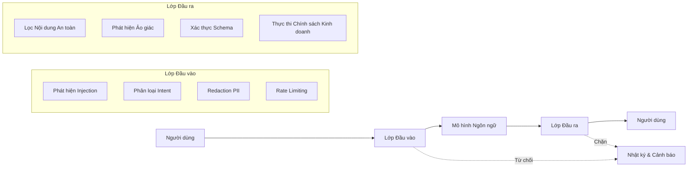

# Guardrails Architecture for Language Model Systems

Language models process untrusted inputs and generate unpredictable outputs. Guardrails are a set of deterministic software mechanisms that surround the model to enforce boundaries that the model itself cannot reliably maintain on its own. They form a defense-in-depth architecture where each layer is designed to catch what the previous layers have missed.

## The Sandwich Model

The most common guardrails architecture in production is a three-layer model, often called the sandwich architecture: an input control layer before data reaches the model, the model processes it, and an output control layer before the response reaches the user. Each layer serves a distinct purpose and fails independently.

### The Input Layer

The input layer processes data before it reaches the model. Its primary function is prompt injection detection — identifying input patterns that attempt to override system instructions. Techniques include statistical perplexity analysis to detect unusually structured text, embedding comparison to detect variants of known attack patterns, and syntactic analysis to detect imperative structures hidden in seemingly harmless text.

Intent classification determines the purpose of the query: legitimate question, support request, manipulation attempt, or out-of-scope query. A lightweight classifier, typically a small language model or a specialized text classification model, evaluates intent before the query reaches the main model. Queries classified as manipulation or out-of-scope are blocked without further processing.

PII redaction detects and removes personally identifiable information from input before it leaves the organization's infrastructure. For systems processing sensitive data, this step is mandatory by regulation and must operate with high precision — a missed email address is a compliance incident.

### The Output Layer

The output layer evaluates the model's response before it reaches the user. The safety content filter detects toxic language, violent content, illegal material, or any content that violates acceptable use policies. Specialized classification models, often trained on diverse content safety datasets, evaluate the response across multiple dimensions simultaneously.

Hallucination detection is the hardest problem in the output layer. Techniques include groundedness checking — verifying that every factual claim in the response can be attributed to a specific source document in the retrieved context; internal consistency checking — verifying that the response does not contradict itself; and inter-query consistency checking — verifying that responses to the same question do not change significantly across calls.

Schema validation ensures the response conforms to the expected format, which is especially important when the model is asked to generate structured JSON or follow a specific schema. A response that does not conform to the schema should not reach downstream systems as it will cause parsing errors.

Business policy enforcement applies domain-specific rules. For example, a customer support chatbot may be prohibited from promising refunds above a certain threshold without human approval. The output layer checks these conditions and blocks or flags violating responses.

## Designing for Independent Failure

Each guardrail layer must be designed to fail safely and independently. If the input filter crashes, the system should default to rejecting the query rather than allowing it through unchecked. If the output filter is unavailable, the system should return a predefined safe response instead of forwarding the model's raw output.

Independence also means each layer uses different technology and detection mechanisms. A regex-based input filter should be complemented by an ML-based classifier. If an attacker bypasses one mechanism, the other still operates. Defense-in-depth in the guardrails context is not about redundancy — it is about diversifying detection mechanisms.

## Design Principles

Guardrails design rests on three principles. First, guardrails are deterministic software surrounding a probabilistic model — they must behave predictably, testably, and auditably. Do not use a language model as a guardrail for itself without an independent verification mechanism. Second, guardrail latency is part of the overall latency budget — each layer adds processing time, and the total must remain within acceptable limits for user experience. Third, guardrails must be updatable independently of the model — when a new attack pattern emerges, you need the ability to update the filter without redeploying the entire system.
