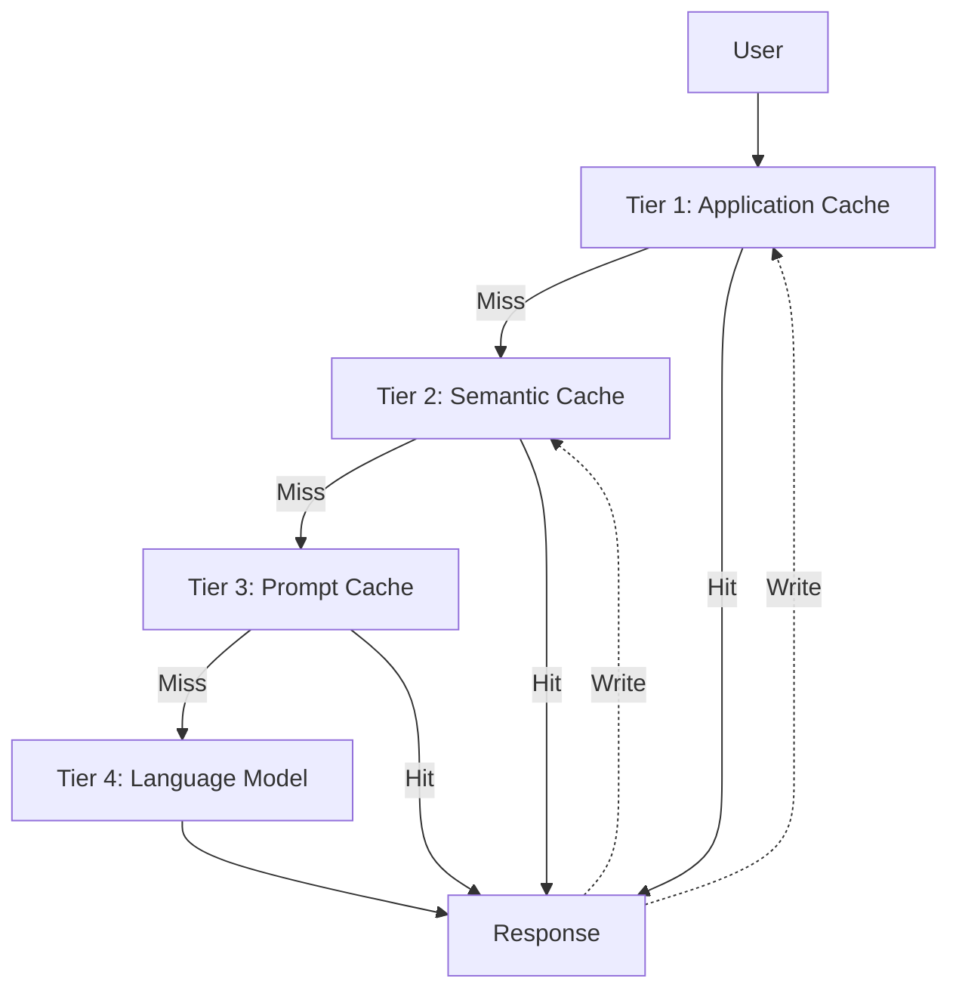

# Caching Architecture for Language Model Systems

In production-scale language model systems, every generated token consumes computational resources and financial cost. Caching is the highest-leverage cost optimization tool: a cached response costs nearly zero compared to invoking the model to regenerate from scratch. However, caching in the context of language models presents unique challenges due to the non-deterministic nature of outputs and the infinite diversity of inputs.

## Caching Tiers

Caching architecture for language model systems operates at multiple tiers, from closest to the model to closest to the user. Each tier has its own characteristics regarding cache hit rate, latency, and data integrity requirements.

### Tier 1: Application Cache

Traditional cache at the application level, storing exact query-response pairs. If User A asks "What is the refund policy" and User B asks the identical question, the cache returns the stored response without invoking the model. The hit rate of exact cache is typically low — under 5 percent for most applications — because users rarely ask identically worded questions. However, for static system prompts and templates that do not change between users, application cache can completely eliminate processing costs.

### Tier 2: Semantic Cache

Instead of requiring exact match, semantic cache stores query-response pairs and compares new queries based on embedding similarity. When a user asks "How do I return a product" and the cache contains a response for "Product return procedure," the system computes embeddings for the new query, finds the most similar cached query above a similarity threshold, and returns the stored response.

The similarity threshold is the most critical parameter. Set too high, and the hit rate drops sharply. Set too low, and the cache returns inappropriate responses for queries that are semantically different but nearby in embedding space. Typical threshold values range from 0.85 to 0.95 for most modern embedding models, but must be calibrated based on the specific query distribution.

### Tier 3: Prompt Cache

Prompt cache operates at the model infrastructure level, automatically detecting and storing repeated prompt prefixes. When multiple requests share the same prefix — such as system prompts, instruction templates, or commonly retrieved context — prompt cache stores the computational state of that prefix and reuses it for subsequent requests. The result is that processing cost for the prefix portion is significantly reduced, typically by 50 percent.

Optimizing for prompt cache requires intentional prompt design: place static, shared content at the beginning of the prompt, and dynamic, variable content at the end. A stable system prompt followed by retrieved context and finally the user query — this structure maximizes the length of the cacheable prefix.

## Cache Invalidation and Consistency

A cache inconsistent with the source data is the root of most cache-related errors. For language model systems, the invalidation problem arises when source data changes — policy documents are updated, product prices change, or contact information is revised.

Event-driven invalidation is the most reliable approach. When source data changes, an event is emitted. Cache subscribers listen for this event and invalidate all affected cache entries. For semantic cache, this requires reverse mapping — knowing which queries relate to which documents — which can be maintained through metadata or through analysis of the retrieval component of each cached response.

TTL-based invalidation is simpler but less precise. Each cache entry has a fixed time-to-live. After expiry, the entry is invalidated and the next request invokes the model for a fresh response. Short TTLs ensure consistency but reduce hit rates. Long TTLs increase hit rates but risk serving stale information.

## Design Principles

Caching design for language model systems rests on three principles. First, cache in tiers — each tier has different hit rates and storage costs, and the combination of multiple tiers produces an overall hit rate superior to any single tier. Second, measure hit rate and storage cost — if the cost of storing and maintaining the cache exceeds the savings from avoided model invocations, the cache is causing harm rather than providing benefit. Third, invalidation must be designed concurrently with the cache — you cannot add invalidation after the cache has been deployed, because the cache architecture determines what can and cannot be invalidated efficiently.
