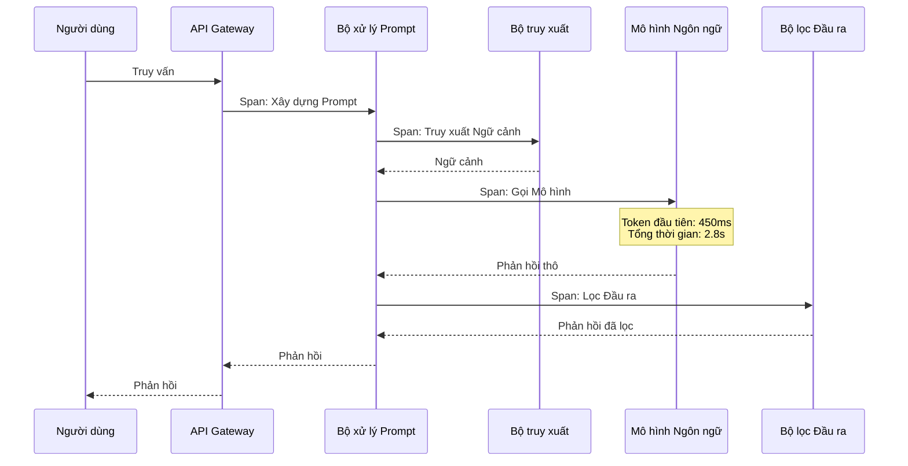

# Observability for Language Model Systems

Observability in the context of language models is fundamentally different from traditional application monitoring. Traditional APM tools tell you about latency and error rates. They do not tell you what your prompt actually looked like when the model hallucinated, which user query triggered the most expensive model call, or whether output quality is degrading over time.

## The Three Pillars of LLM Observability

### Tracing: Tracking the Full Request Lifecycle

Every request to a language model system goes through multiple stages: query reception, preprocessing, context retrieval, prompt construction, model invocation, postprocessing, output filtering. A distributed trace records this entire journey, with each stage represented as a span with start time, end time, metadata, and status.

Tracing enables answering the question: "Why did this request take 3.2 seconds?" By looking at the span breakdown, you see that context retrieval took 200ms, prompt construction took 50ms, model invocation took 2.8 seconds, and postprocessing took 150ms. The problem lies in the model invocation stage — possibly because the model is processing a large number of tokens or because the inference infrastructure is overloaded.

### Logging: Recording Everything

Logging for language model systems must record the full prompt — including the system prompt, retrieved context, and user query — along with the full response. Without prompt logs, you cannot reproduce or debug any model behavior.

Each log entry should include: the complete prompt (sanitized to remove PII), the complete response, input and output token counts, model version, parameter configuration (temperature, top_p, max_tokens), and trace references. Logs must be structured — JSON format with a consistent schema — so they can be queried and analyzed automatically.

Log retention is a decision that balances storage cost against incident investigation capability. Retaining logs for 30 days enables investigation of most incidents and trend analysis. Longer retention may be necessary for compliance requirements but significantly increases costs.

### Metrics: Measuring What Matters

Core metrics for language model systems include:

Time to first token measures the interval from when the request is sent to when the user sees the first character of the response. High TTFT creates a sense that the system is unresponsive, even if total generation time is acceptable. Typical thresholds: under 500ms for a good experience, under 200ms for an excellent experience.

Token generation rate measures the number of tokens generated per second during the streaming phase. Below 15 tokens per second, the reading experience begins to feel sluggish. Above 30 tokens per second, users rarely notice any latency.

Error rates classified by type: model errors (timeout, service denial), application errors (parse failure, validation failure), and user errors (invalid input, exceeded limits). Each error type requires a different response.

Cost distribution over time, by user, by feature, and by model. Without cost allocation, you cannot optimize — a feature consuming 80 percent of the API budget needs attention, but you only know that if you measure it.

## Anomaly Detection

Observability is not just about observing — it is about detecting when something is wrong. Common anomalies in language model systems include: rejection rate spikes (may indicate a jailbreak attack), average response length shifting significantly (may indicate prompt regression), cost distribution shifting (some users or features suddenly consuming more tokens), and error rate increases (may indicate infrastructure issues or model changes).

Alerting thresholds should be based on standard deviation, not absolute values. A metric that fluctuates within a narrow range should trigger an alert for small deviations. A metric with naturally high variance (like hourly cost) should have a wider threshold to avoid false alarms.

## Design Principles

Observability for language model systems rests on three principles. First, log everything — prompts, responses, token counts, latency, errors. The data you do not collect today is the question you cannot answer tomorrow. Second, cost is a first-class metric, not an afterthought — every architectural decision has financial consequences, and those consequences must be visible on the same dashboard as latency and error rates. Third, alerts must be actionable — every alert should come with a runbook describing exactly what to check and how to remediate.
