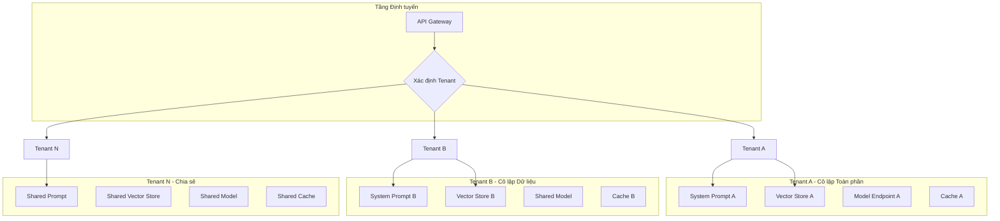

# Multi-Tenant Architecture for Language Models

When a language model system serves multiple customers or multiple departments within the same organization, the question of multi-tenancy becomes unavoidable. Multi-tenancy is not just a data isolation problem — it is a problem of cost isolation, performance isolation, configuration isolation, and risk isolation. One tenant should not be able to degrade the experience of another tenant, whether accidentally or intentionally.

## Isolation Models

### Application-Level Isolation

The simplest model: a single system serves all tenants, with application logic distinguishing tenants based on request context. Each request carries a tenant identifier, which is used to determine the system prompt, the knowledge base to retrieve from, safety policies, and model configuration.

The advantage is simplicity in implementation and operations — only one system to maintain. The disadvantage is weak isolation: a problematic tenant (heavy queries, prompt injection attacks) can affect all other tenants through resource contention or model quality degradation.

### Data-Level Isolation

Each tenant has its own knowledge base — a separate vector database, document store, or cache — while sharing the same language model and application logic. This prevents data leakage between tenants: Tenant A's queries never retrieve Tenant B's documents.

Data isolation is the minimum requirement for most enterprise deployments. It also allows each tenant to have its own chunking strategy, embedding model, and retrieval configuration — different tenants may have different document types requiring different processing strategies.

### Model-Level Isolation

Each tenant has its own model instance — possibly a dedicated model endpoint, a dedicated deployment, or even a dedicated fine-tuned model. This is the highest level of isolation, providing maximum performance guarantees and customization, but with the highest operational cost.

Model isolation is suitable when tenants have significantly different requirements for latency, throughput, or model behavior. A tenant processing medical documents may need a model fine-tuned with specialized terminology. Another tenant running a retail chatbot may prioritize low latency and use a lighter model.

## Cost Allocation and Limits

Each tenant must have its own cost budget, tracked and enforced independently. This requires tagging every language model call with a tenant identifier and aggregating costs in real time.

Per-tenant rate limiting prevents one tenant from consuming disproportionate resources. Common algorithms include token bucket (allows short-term bursts but limits average rate) and sliding window (limits the number of requests within a sliding time interval). Limit thresholds should be configured individually per tenant based on service level agreements.

Cost allocation enables chargeback or showback — showing each tenant or department exactly their language model usage costs. This is not just a financial tool but also a mechanism for encouraging efficient usage behavior — when departments see the cost, they have an incentive to optimize prompts and reduce waste.

## Safety Isolation

Different tenants may have different safety policies. A tenant in the education sector may have different content filtering thresholds than a tenant in the financial sector. Guardrails configuration — input filters, output filters, rejection policies — must be differentiated by tenant.

Additionally, a prompt injection attack targeting one tenant should not be able to affect other tenants. This requires session-level and context-level isolation: Tenant A's context never leaks into responses for Tenant B, even if both share the same physical model.

## Design Principles

Multi-tenant architecture for language model systems rests on three principles. First, data isolation is the minimum requirement — no tenant should be able to access another tenant's data, whether accidentally or intentionally. Second, cost isolation enables accountability — each tenant must be able to see and control their own costs. Third, the level of isolation should be proportional to requirements — not every tenant needs full isolation, and applying the highest isolation level to everyone is a waste of resources.
