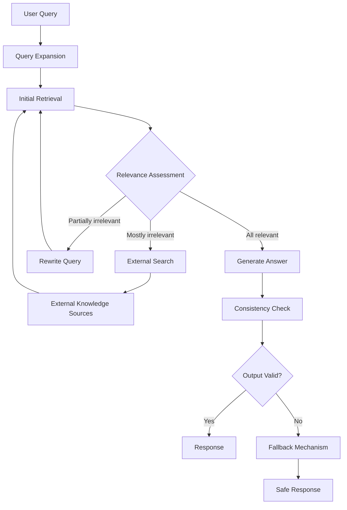

# Advanced RAG Architecture

Retrieval-Augmented Generation is the most prevalent architectural pattern for providing domain-specific knowledge to language models. However, the gap between a simple RAG pipeline working in a prototype and a reliable production system is substantial. This section presents advanced RAG architectural variants that address the limitations of the naive approach and provide design patterns proven in production practice.

## Limitations of Naive RAG

The naive RAG approach divides documents into fixed-size chunks, embeds them into vector space, and at query time returns the k semantically closest chunks to the language model. This approach fails in three common scenarios.

First, chunk boundaries are arbitrary — the most critical information often spans two adjacent chunks, and retrieving only one of those chunks loses the necessary context. Second, semantic similarity does not guarantee factual relevance — a query about a refund policy might retrieve chunks about exchange policies, since both contain the words "policy" and "product," but the refund information resides in a completely different document. Third, the retrieval mechanism has no self-evaluation capability — if the retrieved chunks do not contain the needed information, the model still generates an answer based on what it has, leading to well-grounded hallucinations.



## Sentence Window with Extended Context

Instead of dividing documents by fixed token count, divide by natural sentence boundaries. At query time, identify the sentences with the highest similarity to the query, then expand each sentence by including surrounding sentences — typically one to two sentences before and after. The result is precise retrieval at the sentence level but rich context at the paragraph level.

The primary benefit of this method is resolving the chunk boundary problem — information at the boundary between two chunks is still fully captured because the target sentence is surrounded by its context. The trade-off is increased input token count — each retrieval result consumes more tokens than naive chunking, and the context window budget is depleted more quickly.

## Hybrid Search

Pure vector search based on embeddings misses exact keyword matches. If a user searches for a specific identifier — such as a contract number or project name — semantic search may return documents topically similar but factually irrelevant. Keyword search — based on term frequency and inverse document frequency — captures exact matches but misses semantic variations.

Reciprocal Rank Fusion combines results from both methods into a single ranked list. The RRF formula computes a score for each document based on its rank in each individual list:

```
RRF_score(d) = sum_over_lists(1 / (k + rank_in_list))
```

Where k is a constant (typically 60) that reduces the impact of documents ranked too highly in one list. The final result is a combined list leveraging the strengths of both methods: keyword precision and semantic richness. In practice, hybrid search improves retrieval accuracy by 15 to 30 percent over pure vector search, depending on dataset characteristics.

## Multi-Stage Retrieval with Reranking

Do not run an expensive reranker model over the entire document collection. Use a fast, lightweight retriever to obtain a broad candidate set — typically 50 to 100 documents — then apply a cross-encoder reranker model to evaluate each candidate's true relevance to the query. The reranker processes the query-document pair together, allowing it to understand the relationship between them rather than just comparing independent embedding vectors.

The final result is typically the five most relevant documents from the initial candidate set. The primary trade-off is latency — the reranker requires inference for each query-document pair, adding processing time. For applications where accuracy is paramount — such as legal or medical document retrieval — this latency cost is fully justified.

## Corrective RAG (CRAG)

The fundamental weakness of every RAG system is the assumption that retrieval results are relevant. CRAG adds a self-evaluation step: before generating an answer, the model evaluates whether the retrieved documents actually answer the question. If all documents are relevant, answer generation proceeds normally. If some documents are irrelevant, the model rewrites the query — possibly by adding keywords, removing ambiguous terms, or changing perspective — and retrieves again. If most documents are irrelevant, the system switches to external search — such as web search or an alternative knowledge base.

The practical significance of CRAG is reducing well-grounded hallucinations — answers that are wrong but sound plausible because they are based on irrelevant documents disguised as evidence. When the knowledge base does not contain the needed information, CRAG recognizes the gap rather than filling it with speculation.

## Agentic RAG

The highest level of complexity: the language model acts as an agent that plans its own research. The agent decides which tools to use — vector search, relational database queries, web search, API calls — evaluates intermediate results, and iterates until it has sufficient information to answer. Each step is guided by the agent's assessment of what it knows and what it still needs to discover.

The risk of Agentic RAG lies in its unbounded nature. Without explicit constraints, the agent can loop indefinitely, call expensive APIs repeatedly, or make decisions based on hallucinated intermediate results. Every Agentic RAG production deployment requires: maximum iteration limits, cost budgets per session, output validation at each step, and fallback mechanisms to simpler patterns when the agent struggles.

## Selection Principles

No single RAG pattern is best for every situation. The selection principle is based on three factors: query complexity (simple or multi-step), the nature of the document collection (dynamic or static, structured or unstructured), and accuracy requirements (approximation acceptable or absolute precision required). The wise deployment strategy is to start with hybrid search — the simplest pattern that generates production value — and add complexity only when operational data shows it is necessary.
