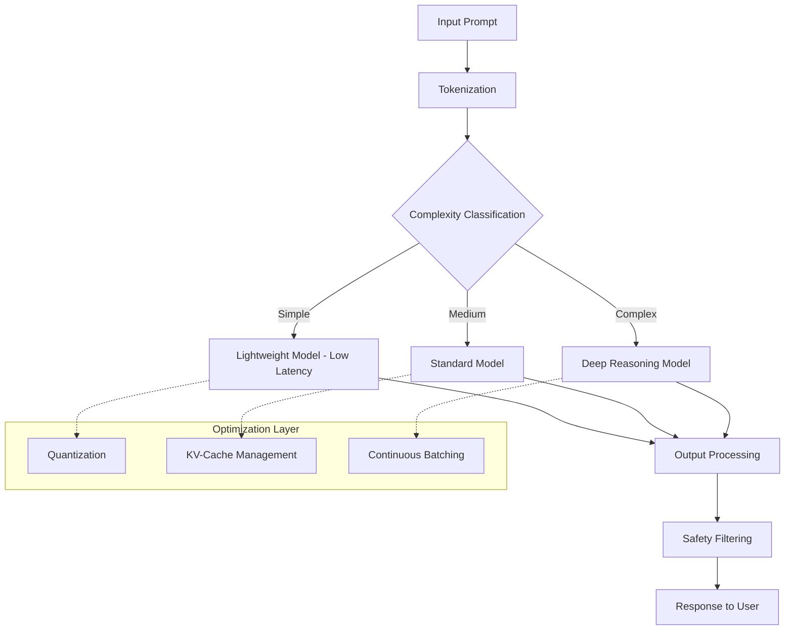
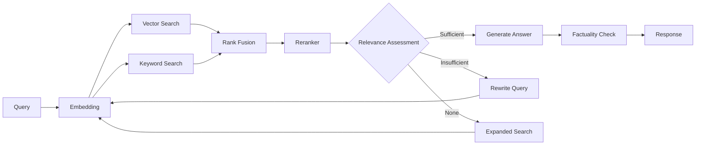

# Large Language Model Engineering

The shift from experimenting with language models to operating them in production environments marks a critical inflection point in software development history. Large language model engineering is the discipline of building, deploying, and operating systems powered by language models at production scale, where requirements for reliability, cost, performance, and safety are all non-negotiable constraints.

## The Essence of Language Model Engineering

Language model engineering is not prompt engineering, though that skill is part of the toolkit. It is also not traditional machine learning, which focuses on training models from scratch. Rather, this field sits at the intersection of machine learning, distributed systems, and product engineering, where pre-trained models are orchestrated, optimized, and safeguarded within complex production pipelines.

A production language model engineer must simultaneously address concerns of latency and throughput — every generated token consumes computational resources and time; cost — every API call carries monetary value; safety — models are vulnerable to attacks in ways that have no equivalent in traditional software; and reliability — building products on probabilistic foundations demands fundamentally different engineering strategies compared to deterministic software.

## Core Knowledge Pillars

### Model Architecture and Training

Understanding transformer architecture, attention mechanisms, loss functions, and training processes is not purely academic knowledge. It is the foundation for every engineering decision: from selecting the right model for a specific task, to debugging when a model produces unexpected results, to predicting the scaling limits of a system. Topics include transformer architectures, attention mechanisms, positional encodings, cross-entropy loss functions, and fine-tuning methods such as RLHF and DPO.

### Inference Optimization

Token generation in production environments presents unique challenges. Model quantization reduces memory footprint and accelerates inference speed. KV-cache optimization minimizes memory costs for long conversation sequences. Continuous batching maximizes GPU utilization. Speculative decoding accelerates text generation. Each technique involves trade-offs between output quality, latency, and throughput — and selecting the optimal configuration depends on the specific characteristics of the workload.

### Model Routing and Orchestration

Not every query requires the most powerful model. Intelligent routing architectures classify query complexity and select the appropriate model, balancing quality, cost, and latency. Strategies include classification-based routing, cascade routing (try a lightweight model first, escalate to a more capable one only when needed), and cost-budget routing. Routing not only saves direct costs but also creates an abstraction layer that enables the system to adapt easily as new models emerge.

### Information Retrieval and Search

Retrieval-Augmented Generation is the most prevalent architectural pattern for enterprise language model applications. From naive RAG to complex variants such as corrective RAG, agentic RAG, and hybrid search, each pattern addresses a specific class of problems regarding accuracy, coverage, and retrieval cost. Topics include chunking strategies, embedding model selection, vector database architecture, reranking, and retrieval pipeline evaluation.

### Model Safety and Protection

Language models present security challenges unprecedented in software history. Prompt injection — where untrusted input is misinterpreted as system instructions — has no definitive solution, only layers of defense. Jailbreaking targets the model's own safety training. Output filtering is the last line of defense. Defense-in-depth — combining multiple protective layers from input to output — is the core principle.

### Open-Source Models and Self-Hosting

Not every application can send data to external APIs. Open-source models enable internal deployment, absolute data control, and fixed costs rather than per-token variable costs. Deployment encompasses quantization techniques, serving framework selection, GPU cluster management, and fine-tuning strategies such as LoRA and QLoRA.

## Core Principles

Language model engineering rests on three foundational principles. First, the non-deterministic nature of models is not a flaw but a design characteristic — systems must be built to operate reliably on uncertain foundations, through mechanisms such as consistency checking, hallucination detection, and structured fallbacks. Second, cost and quality are two sides of the same optimization problem — every architectural decision can be represented as a point on the trade-off curve between accuracy, latency, and financial cost. Third, safety is not a feature added after deployment — it is an architectural property that must be designed from the start, through defense-in-depth, blast radius limitation, and human-in-the-loop mechanisms at critical decision points.
