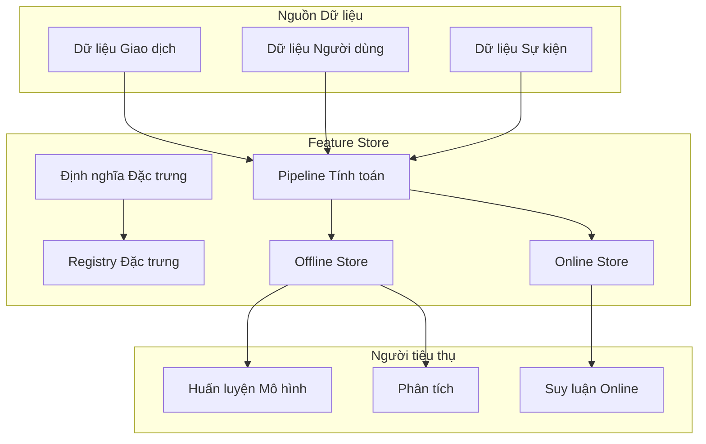

# Feature Stores in Machine Learning Systems

In large-scale machine learning systems, features are often recomputed multiple times by different teams for different models. The same feature — such as "total customer spend over the last 30 days" — may be independently implemented in the recommendation team's training pipeline, the fraud detection team's inference pipeline, and the data team's analytics reports. Feature stores solve this problem by centralizing the definition, computation, storage, and serving of features.

## Feature Store Functions

Centralized feature definitions consolidate feature computation logic. Each feature is defined once — with a name, data type, metadata, and computation logic — and used everywhere. This ensures consistency: the "30-day total spend" feature is computed identically in training and inference, eliminating one of the most common causes of discrepancy between training performance and production performance.

Feature computation can be batch (periodic computation over large datasets), streaming (real-time computation as new data arrives), or on-demand (computed when requested). The feature store manages the execution of these computation pipelines and stores the results.

Feature storage includes the offline store (for training — storing large volumes of historical features with high latency tolerance) and the online store (for inference — storing the latest features with low latency). Data flows from the offline store to the online store after being computed and validated.

Feature serving provides APIs for retrieving features during inference. The API must have low latency — typically under 10ms — as it sits on the critical path of inference requests. Batch APIs provide bulk retrieval capability for training.

## Feature Versioning

Features change over time — computation logic improves, data sources change, or business definitions are adjusted. The feature store must support feature versioning so that the exact state of a feature at any point in the past can be reproduced.

When a model is trained with version 1 of a feature, it must continue using version 1 in inference until retrained with version 2. Using different feature versions between training and inference is a common cause of performance degradation.

## Feature Quality Monitoring

Features can degrade in quality over time — source data changes, computation pipelines encounter errors, or statistical distributions drift. The feature store should monitor feature quality continuously: missing value rates, statistical distributions, and deviation from historical baselines.

When feature quality degrades, alerts are triggered. If the feature is used in inference, quality degradation can directly impact model performance — and must be addressed urgently.

## Design Principles

Feature stores are built on three principles. First, define once, use everywhere — each feature has a single definition, eliminating inconsistency between training and inference. Second, versioning is mandatory — every feature change must be versioned to ensure reproducibility. Third, quality monitoring is continuous — features degrade over time and must be detected before affecting the model.
