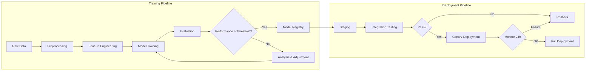

# MLOps and AI Infrastructure

The gap between a model working on a researcher's notebook and a machine learning system serving millions of users is one of the largest gaps in software engineering. MLOps bridges that gap — applying DevOps principles to the machine learning lifecycle, from data preparation to training, evaluation, deployment, and continuous monitoring.

## The Essence of MLOps

MLOps is a methodology combining machine learning, data engineering, and system operations to build reproducible, testable, and monitorable machine learning pipelines in production environments. Unlike traditional DevOps — where the output is a software application operating on deterministic logic — MLOps faces three unique challenges. Data changes over time, causing data drift and concept drift that silently degrade model performance. Model quality is multidimensional — accuracy, latency, fairness, interpretability — and no single metric captures every aspect. Reproducibility is far harder than traditional software because results depend on data, random seeds, library versions, and even the specific GPU hardware used during training.

## Core Knowledge Pillars

### Training and Deployment Pipelines

A machine learning pipeline is a reproducible sequence of processing steps, from raw data collection to a deployed model. The pipeline must be automated — from detecting new data, triggering retraining, evaluating the new model against the current one, to deploying if performance improves. Deployment strategies include static deployment (replacing the old model with the new one), shadow deployment (the new model receives traffic but does not serve users), and canary deployment (a small fraction of traffic is routed to the new model before full rollout).

### Feature Stores and Data Management

In large-scale machine learning systems, feature computation is often repeated across multiple models and use cases. A feature store centralizes the definition, computation, and serving of features, ensuring consistency between training (offline) and inference (online). Feature data is versioned over time, enabling precise reproduction of data state at any point in history. Data quality monitoring continuously checks the statistical properties of input data and alerts when deviations are detected — missing values, distribution shifts, or unusual outliers.

### Model Lifecycle Management

Models are not static artifacts — they have a lifecycle from development to deployment to retirement. A model registry centralizes the storage, versioning, and metadata management of models. Each model version is linked to training source code, dataset, evaluation metrics, and environment parameters. This enables complete provenance — when a model in production produces unexpected results, you can trace back exactly what changed and when. Experiment tracking records every training run — parameters, metrics, artifacts — and enables visual comparison between experiments to identify improvement directions.

### GPU and Specialized Compute Infrastructure

Training and inference of large models require specialized computational resources. GPU cluster management includes scheduling training jobs, dynamic resource allocation, and hardware failure handling. Techniques such as Multi-Instance GPU enable partitioning a physical GPU into multiple independent instances, optimizing utilization for smaller workloads. For inference, specialized serving frameworks optimize GPU memory usage through continuous batching, KV-cache management, and quantization — enabling multiple models to be served simultaneously on the same hardware cluster.

### Model Monitoring in Production

Model monitoring is fundamentally different from traditional application monitoring. Instead of just tracking latency and error rates, you need to track data drift — changes in input data distribution over time; concept drift — changes in the relationship between inputs and expected outputs; and model staleness — performance degradation simply because the world has changed since the model was trained. These metrics must be continuously collected, compared against baselines from test sets, and trigger alerts or automated retraining when thresholds are exceeded.

## Core Principles

MLOps rests on three foundational principles. First, reproducibility is non-negotiable — every pipeline component, from data version to code version to environment version, must be recorded and precisely reproducible. There is no "it works on my machine" in production machine learning. Second, continuous monitoring is mandatory — models degrade over time, data changes, and if you do not measure that degradation, you will not know until users complain. Third, automation is the only path to scale — manual retraining, manual deployment, and manual monitoring cannot scale when the number of models grows from one to dozens.
