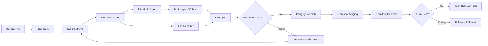

# Machine Learning Model Training and Deployment Pipeline

A machine learning pipeline is a reproducible sequence of processing steps, from raw data to a model deployed in a production environment. Unlike traditional software development — where the output is an application artifact operating on deterministic logic — ML pipelines must contend with the non-deterministic nature of data, performance degradation over time, and dependency on environmental factors such as library versions and training hardware.

## Pipeline Stages

The data collection and preprocessing stage is responsible for transforming raw data — from multiple heterogeneous sources — into a standardized format ready for training. Operations include data cleaning (handling missing values, removing noise), normalization (bringing features to the same scale), and augmentation (generating additional training data through transformations). The quality of this stage determines the upper bound of model quality — no training algorithm can compensate for poor-quality input data.

The feature generation stage extracts meaningful attributes from raw data. Features are the bridge between raw data and the model — they represent domain knowledge in a form the model can learn. Feature engineering is one of the highest-leverage activities in machine learning: a well-designed feature can improve model performance more than switching to a more complex algorithm.

The model training stage is where the algorithm learns patterns from the data. This process includes algorithm selection, hyperparameter configuration, and training execution — often on specialized hardware such as GPUs. Experiment tracking records every training run: parameters, metrics, and artifacts — enabling later comparison and reproduction.

The evaluation stage determines whether the model meets quality criteria for deployment. Evaluation must be performed on a separate dataset — not the data used for training — to measure true generalization ability. Evaluation metrics must reflect business objectives, not just abstract technical indicators.

## Reproducibility

Reproducibility is a non-negotiable requirement for production ML pipelines. Every training run must be exactly reproducible — same data, same code, same environment, same results. This requires versioning every component of the pipeline: data (dataset version), code (commit hash), environment (container image or lock file), and hyperparameters (stored configuration files).

## Automation

Training pipelines should be triggered automatically by events: new data added, code updated, or scheduled intervals. Automation eliminates human error and ensures models are retrained regularly to adapt to changing data.

Deployment pipelines should include automated testing: unit tests for data processing code, integration tests for the entire pipeline, and quality tests for the model (comparison against baseline, regression checks). Only when all tests pass should a model be deployed.

## Design Principles

ML pipelines are built on three principles. First, reproducibility is the foundation — there is no "it works on my machine" in production machine learning. Second, automation is the only path to scale — manual training cannot scale as the number of models grows. Third, evaluation is continuous — models degrade over time, and only continuous evaluation can detect degradation before users complain.
