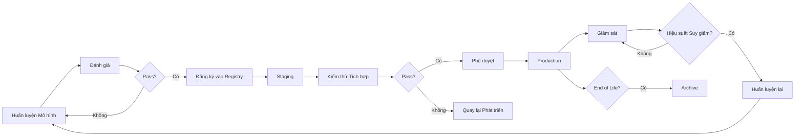

# Model Lifecycle Management and Model Registry

Machine learning models are not static artifacts — they have a lifecycle from experimental development to production deployment to retirement. As the number of models in an organization grows from one to dozens, managing this lifecycle becomes a significant operational challenge. The model registry is the central component that addresses this challenge — it is the system of record for every model, storing metadata, versions, and artifacts, and providing complete provenance tracking.

## Model Registry Functions

Model registration is the core function. Every time a model is trained and passes evaluation, it is registered in the registry with a unique identifier. The registry stores the model artifact (weights, configuration), metadata (who trained it, when, on which dataset), and evaluation metrics (accuracy, latency, model size).

Versioning tracks different versions of the same model over time. Each version has a unique number and is linked to the training code's commit hash, dataset version, and hyperparameter configuration. This enables exact reproduction of any version — you can go back and retrain exactly the same model if needed.

Stage management tracks models across environments: staging (being tested), production (serving traffic), archived (no longer in use but retained for reference). Promoting a model from staging to production is a deliberate, recorded decision in the registry, not a file overwrite.

Provenance enables answering the question: where did this model come from? When a model in production produces unexpected results, you can trace back through the registry: model version, training code, dataset, evaluation metrics, approver. Every step in the model's journey is recorded.

## Metadata and Searchability

As the number of models grows, searchability becomes critical. The registry must support searching by multiple criteria: model name, version, status, trainer, training date, performance metrics, model type. Tags and labels allow organizing models into groups — such as "classification", "prediction", "text generation" — for easy navigation.

Model comparison is a powerful feature: select two or more versions and display their metrics side by side. This enables data-driven decisions about whether a new version actually improves upon the current one, and on which dimensions.

## Pipeline Integration

The model registry is not a standalone system — it integrates with the training pipeline (automatically registering models after training), the deployment pipeline (automatically fetching models from the registry for deployment), and monitoring systems (updating model status based on production performance).

The registry API enables full lifecycle automation: training, registration, testing, approval, deployment, monitoring, retirement — all through API calls, not through a user interface.

## Design Principles

Model lifecycle management is built on three principles. First, every model in production must have clear provenance — you must be able to trace back from a running model to the code, data, and person who created it. Second, model promotion is a deliberate decision — no model automatically goes from training to production without testing and approval. Third, the registry is the single source of truth — all other systems (deployment, monitoring, reporting) reference the registry to know which model version is active where.
