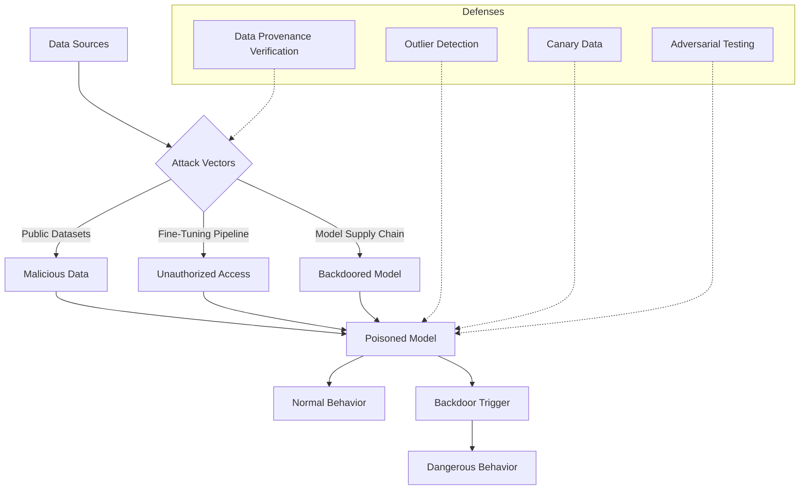

# Detecting and Defending Against Data Poisoning Attacks

Data poisoning is an attack on the supply chain of artificial intelligence systems: the attacker introduces malicious data into the training dataset, and the model learns hidden behaviors from that data. The consequence is that the model behaves normally on most inputs but acts dangerously when encountering a specific trigger — a keyword, a data pattern, or a combination of features that the attacker has planted. This is one of the most serious threats to AI systems because it exploits the model's own learning mechanism, making detection extraordinarily difficult.

## Attack Vectors

### Public Dataset Poisoning

Attackers introduce malicious data into public datasets widely used for model training. Datasets such as web crawls, collaborative knowledge bases, or open-source data repositories are attractive targets because they are used by many organizations. Once malicious data is in the dataset, every model trained on it becomes potentially affected.

### Fine-Tuning Pipeline Poisoning

Many organizations fine-tune existing models on their own data. If an attacker can infiltrate the fine-tuning pipeline — through compromised accounts, vulnerabilities in data collection systems, or insider threats — they can inject malicious data directly into the fine-tuning process.

### Model Supply Chain Poisoning

An attacker publishes a model that appears to perform well on standard benchmarks but contains a backdoor planted during training. Organizations download this model, fine-tune it on their data, and deploy — without knowing that the backdoor persists after fine-tuning.

## Detection Strategies

Outlier detection is the first line of defense. Malicious data often has statistical characteristics that differ from natural data: unusual lengths, abnormal vocabulary distributions, or unnatural repetitive patterns. Embedding-based outlier detection techniques can identify data points that lie far from the main distribution in feature space.

Feature analysis is the second line of defense. Backdoors create spurious correlations between input features and output labels — correlations that do not exist in natural data. Statistical analysis can detect these unusual correlations, especially when they are concentrated in a small subset of data.

Canary data is the third line of defense. Inject known data points — with unique patterns — into the training set and monitor the model's behavior on these data points. If the model behaves abnormally on canary data, the training process may have been tampered with.

## Defensive Strategies

Data provenance verification is the most fundamental defensive principle. Every data point in the training set must have clear provenance: who collected it, when, from what source, and what transformations it has undergone. Cryptographic signatures ensure that data has not been modified since collection.

Access control to the training pipeline — only authorized personnel can modify training data, training configurations, or model artifacts. Every modification must be logged and auditable.

Periodic adversarial testing — systematically searching for backdoor triggers by exploring input space for patterns that cause abnormal behavior. This is computationally challenging but necessary for high-risk systems.

## Core Principles

Defense against data poisoning rests on three principles. First, trust no data source by default — every externally sourced data must be verified before entering the training pipeline. Second, outlier detection is continuous, not one-time — datasets grow over time, and new data may bring new threats. Third, assume the model may be compromised — design system architecture to limit the blast radius of a poisoned model, preventing it from performing irreversible actions without human oversight.
