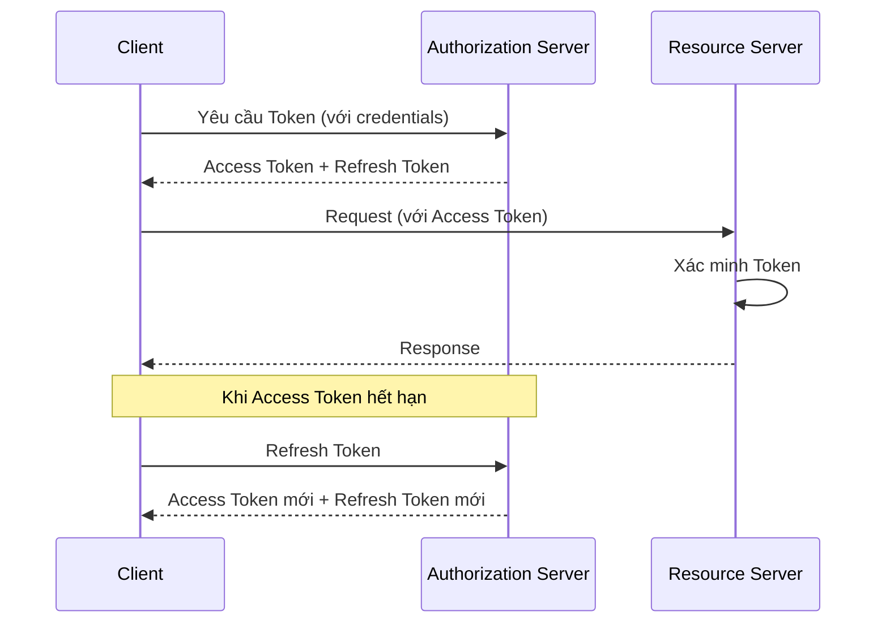

# API Authentication and Authorization Patterns

Authentication answers the question "who are you." Authorization answers the question "what are you allowed to do." Both questions must be answered for every API request, and the answers must be consistent, unforgeable, and scalable. Choosing the right authentication and authorization pattern is the most critical security decision in API design.

## Authentication Patterns

### Bearer Token

Bearer token is the simplest and most common pattern. The client receives a token from the authorization server after successful authentication, and sends this token in the Authorization header of every subsequent request. The resource server verifies the token — typically by checking the cryptographic signature or calling an introspection endpoint — and extracts the user's identity.

Bearer tokens have the advantage of being simple and stateless — the resource server does not need to maintain sessions. The main drawback is that the token is a bearer instrument: anyone in possession of the token can use it. If a token is stolen, the attacker has full access until the token expires. This is why bearer tokens should have a short lifetime and be combined with refresh tokens for renewal.

### JSON Web Token

JWT is the most popular token format for bearer tokens. A JWT consists of three base64url-encoded parts: the header (declares the signing algorithm), the payload (contains claims about the user and token), and the signature (verifies the token has not been tampered with). JWT allows the resource server to verify the token without calling the authorization server — simply by verifying the signature with the public key.

Claims in a JWT can include: subject (sub — user identifier), expiration time (exp), issued-at time (iat), and custom claims such as roles, permissions, or tenant ID. Claims enable the resource server to make authorization decisions without querying a database — authorization information is embedded directly in the token.

### OAuth 2.0 and OpenID Connect

OAuth 2.0 is an authorization framework that allows third-party applications to access a user's resources without knowing their password. It defines four grant flows: authorization code (for web applications with a backend), PKCE (for mobile and single-page applications), client credentials (for machine-to-machine communication), and device code (for browserless devices).

OpenID Connect is an identity layer built on top of OAuth 2.0, adding standard identity claims and a UserInfo endpoint. When you "sign in with Google," you are using OpenID Connect — OAuth 2.0 handles authorization, OpenID Connect handles authentication.

## Authorization Patterns

### Role-Based Access Control

RBAC assigns permissions to roles, and roles to users. This is an intuitive and easily managed model for systems with a clear organizational structure. For example: the "Administrator" role has read, write, and delete permissions; the "Editor" role has read and write permissions; the "Viewer" role has only read permissions.

A limitation of RBAC is role explosion: as the organization grows, the number of roles increases rapidly and management becomes complex. RBAC also does not handle context-based permissions well — such as "only allow access during business hours" or "only allow access from the corporate network."

### Attribute-Based Access Control

ABAC makes authorization decisions based on attributes of the user, resource, action, and context. Instead of "role X has permission Y," ABAC says "a user with department attribute Engineering and seniority level Senior can perform the deploy action on resources tagged with environment staging."

ABAC is more flexible than RBAC and avoids the role explosion problem, but is more complex to design and debug. ABAC policies can become difficult to understand as the number of attributes and rules grows.

## Design Principles

API authentication and authorization design rests on three principles. First, defense in depth — do not rely on a single mechanism. Combine strong authentication, short-lived tokens, refresh token rotation, and anomaly monitoring. Second, least privilege — every identity should have only the minimum permissions necessary to perform its function, and those permissions should be periodically reviewed and revoked. Third, centralized authorization decisions — authorization logic should be centralized in a dedicated service, not distributed across the source code of each individual service.
