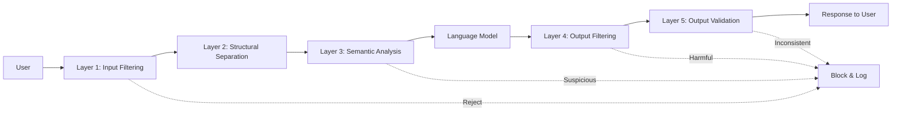

# System Security and Artificial Intelligence

Traditional application security is a mature discipline. We know how to prevent SQL injection, how to manage TLS certificates, how to design least-privilege access policies. Security for artificial intelligence systems is uncharted territory — with entirely new attack surfaces, threat models still being catalogued, and defensive techniques lagging behind the attacks they are designed to prevent.

## The Essence of Security in the AI Era

Large language models introduce attack vectors unprecedented in software history. The model itself is the attack surface — you cannot place a firewall in front of a prompt. The model processes untrusted input by design, and that input can manipulate model behavior in ways traditional input validation cannot detect. Non-determinism is a security risk — the same prompt can produce different outputs across invocations, making it impossible to guarantee that a safety filter works 100 percent of the time. The boundary between data and code blurs — a prompt is a hybrid of data and instructions, and attackers exploit this ambiguity to make the model treat attacker-controlled text as system-level commands.

## Core Knowledge Pillars

### Prompt Security

The prompt is the sole interface between the application and the language model — and the primary attack surface. Prompt injection occurs when untrusted user input is misinterpreted by the model as system instructions, overriding developer-defined behavior. Jailbreaking is a variant that targets the model's own safety training, persuading it to do what it was explicitly trained to refuse. Defense-in-depth — combining multiple protective layers from input filtering, structural separation, semantic analysis to output filtering — is the core principle because no single technique stops all attacks.

### AI Threats

Threats targeting AI systems exploit the very process of machine learning — training data, inference behavior, and the information encoded in model parameters. Adversarial attacks use inputs finely tuned to cause models to misclassify or produce harmful outputs, while appearing completely normal to humans. Data poisoning injects malicious data into the training pipeline, causing the model to learn hidden behaviors triggered only by specific activations. Model inversion reconstructs sensitive training data from model outputs — the model intended to protect data becomes the mechanism that leaks it. Membership inference determines whether a specific record was in the training set, which itself is sensitive information in many contexts.

### Cloud Infrastructure Security

The infrastructure layer beneath AI applications requires traditional security measures applied systematically. Identity and access management following the principle of least privilege ensures each service has only the minimum necessary permissions. Network isolation keeps resources in private subnets inaccessible from the internet. Encryption at rest and in transit protects data at every point in the pipeline. Continuous monitoring — through audit logs, machine learning-based threat detection, and automated compliance evaluation — detects anomalies before they become incidents.

### Compliance and Governance

Regulatory compliance frameworks — such as SOC 2, ISO 27001, PCI-DSS, GDPR, and HIPAA — impose requirements for security controls, data privacy, and auditability. In cloud environments, compliance can be automated: evidence is continuously collected, controls are validated in real time, and audit readiness is a property of the architecture, not a quarterly fire drill. Policy-as-code tools enable defining compliance rules as source code and enforcing them in CI/CD pipelines, preventing violating changes before they reach production.

### Authentication and Authorization

Centralized authentication through Single Sign-On enables users to prove their identity once and access all authorized resources. The SAML, OAuth 2.0, and OpenID Connect protocols form the backbone of modern authentication systems. JSON Web Tokens provide a mechanism for carrying claims between parties without querying a database for each request. Session management — from creation to maintenance to revocation — is where most security vulnerabilities reside, and techniques such as refresh token rotation, session hijacking detection, and concurrent session control are essential defenses.

## Core Principles

Security in the AI era rests on three foundational principles. First, defense-in-depth — no single mechanism is sufficient, and each layer must be designed with the assumption that previous layers have failed. Second, assume breach — design every system as if the attacker is already inside. Encrypt everything. Log everything. Segment everything. There is no trusted internal network. Third, safety is an architectural property, not a feature — it must be designed from the start, through clear boundaries, predictable failure modes, and blast radii small enough that a single incident does not escalate into a system-wide catastrophe.
