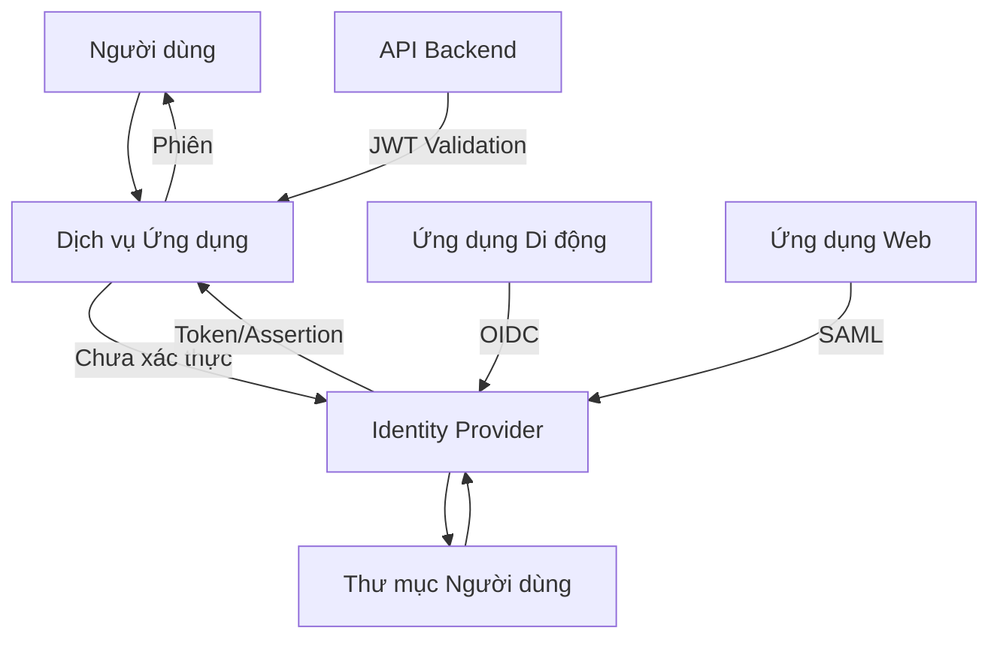

# Implementing Single Sign-On in the Enterprise

Implementing Single Sign-On in an enterprise environment involves integrating multiple systems — identity providers, service providers, user directories, and security policies — into a unified authentication architecture. This is not only a technical challenge but also an organizational one: each system has its own authentication model, each team has its own access requirements, and the migration from individual authentication to SSO must happen without disrupting business operations.

## Reference Architecture

The identity provider is the center of the SSO architecture. The IdP is responsible for authenticating users, issuing tokens or assertions, and maintaining the login session. The IdP connects to the user directory — typically Active Directory or LDAP — to verify credentials and retrieve group and role information.

Service providers are the applications users want to access. SPs trust the IdP to authenticate users and do not authenticate users themselves. When a user attempts to access an SP, the SP redirects them to the IdP. After authentication, the IdP sends an assertion about the user's identity to the SP, and the SP creates a local session.

The protocol connecting the IdP and SP depends on the application type and security requirements. SAML 2.0 dominates in traditional enterprise environments with web applications. OpenID Connect is increasingly popular for modern applications — mobile, single-page, and API-first.

## Service Provider Integration

Each application must be integrated with the IdP. The integration process includes: registering the application with the IdP (receiving a client ID or entity ID), configuring endpoints (redirect URI, callback URL, metadata endpoint), defining claim mapping (which user attributes are sent from the IdP to the application), and configuring the application to trust the IdP.

For SAML, integration requires exchanging XML metadata between the IdP and SP. Metadata contains the entity ID, certificate for signature verification, and endpoint URLs. For OpenID Connect, integration is simpler — the application needs the client ID, client secret, and the IdP's discovery URL.

## Access Policies

Conditional Access is an additional security layer on the IdP. Instead of only verifying credentials, the IdP evaluates the context of the login request: the user's geographic location, device compliance status, session risk level, time of day. Based on these signals, the IdP can require additional authentication — such as MFA — or deny access.

For example: a user attempts to access from a new country — require MFA. A user accesses from a device not compliant with company policy — deny access. A user accesses from the office during working hours — allow access with basic authentication.

## Migrating from Individual Authentication

Migrating to SSO is a process, not an event. Migration strategy: start with new applications (implement SSO from the start), then migrate existing applications by priority based on risk and complexity. During the migration period, the IdP can operate in parallel with the legacy authentication system — users can log in through both mechanisms.

Once all applications have been migrated, disable individual authentication. This is a critical step — if individual authentication persists, it becomes a backdoor bypassing all of the IdP's security policies.

## Design Principles

Enterprise SSO implementation rests on three principles. First, the IdP is the single source of truth for authentication — no system authenticates users on its own. Second, centralized policy, distributed enforcement — access policies are defined once on the IdP and enforced by all applications. Third, gradual migration — transition one application at a time, verifying correct operation before moving to the next application.
