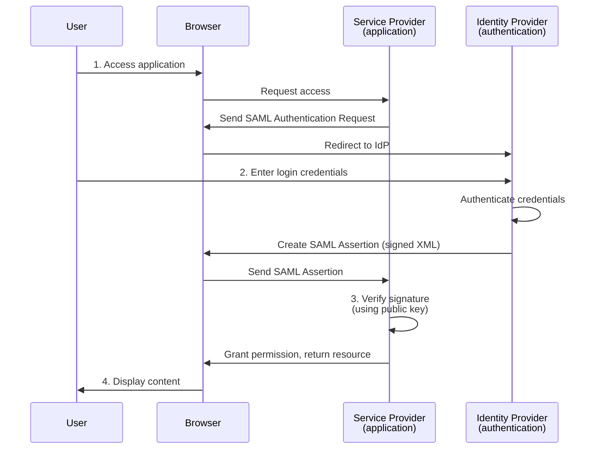
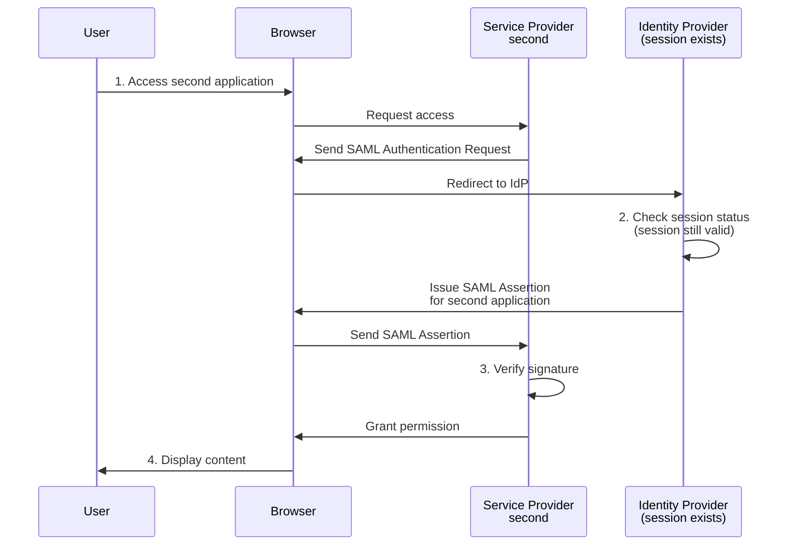

# [Eng] Introduction so SSO

## Introduction: The context of centralized authentication

In the modern enterprise environment, users need to access multiple applications and services throughout the day. Each traditional application requires users to re-enter authentication credentials, creating inefficiencies and increasing security risks. Single Sign-On (SSO) addresses this problem by allowing users to authenticate once and then access multiple applications without needing to log in again. This article analyzes the architecture, protocols, and operational flow of SSO from a methodological perspective.

## Fundamental Concepts: SSO and Federated Identity

### Definition and Purpose

Single Sign-On is an authentication model that allows users to use a single set of login credentials to securely access multiple independent applications and services. Instead of maintaining separate accounts on each platform, SSO centralizes the authentication process through a single verification mechanism, reducing the burden on users and enhancing identity management across the entire system.

### Foundation: Federated Identity

SSO is built on the concept of **Federated Identity**. This model enables secure sharing of identity information between independent systems that have mutual trust relationships. Rather than each application managing its own separate user database, federated identity allows delegation of authentication responsibility to a trusted third party, while other applications only need to verify the validity of the identity information provided.

## Two Main Protocols: SAML and OpenID Connect

### SAML – XML-based Standard

**SAML** (Security Assertion Markup Language) is an open standard based on XML used to exchange identity information between services. Developed primarily for enterprise environments, SAML works by creating assertions – cryptographically signed XML documents – to verify that a user has been authenticated and has access to specific resources.

SAML's advantages lie in its robustness in complex enterprise environments where detailed access control is required. However, its XML-based structure makes it heavier than other protocols, particularly for mobile applications or high-throughput scenarios.

### OpenID Connect – JWT-based Standard

**OpenID Connect** is an authentication layer built on the OAuth 2.0 foundation, using JWT (JSON Web Token) instead of XML to exchange identity information. JWT is a cryptographically signed JSON document that is more compact than SAML assertions, making it more suitable for modern web applications and mobile services.

OpenID Connect has become prevalent in personal and public platform contexts. For example, when users sign in to applications like YouTube using their personal Google account, they are using OpenID Connect. This protocol provides higher interactivity and is well-suited for microservices architecture and distributed systems.

### Comparison of Data Formats

The core difference between the two protocols is the format of identity information being exchanged. SAML uses XML as the fundamental format, while OpenID Connect uses JSON Web Token. This directly affects payload size, processing speed, and convenience in integrating with different systems.

## SAML Authentication Flow: From Request to Authorization

### Key Architectural Participants

To understand the mechanism of SAML, it is essential to grasp three main roles in the system:

- **Service Provider (SP):** The application that users want to access, such as an email service or project management platform. The Service Provider does not manage user authentication itself; instead, it delegates this responsibility to the Identity Provider.
- **Identity Provider (IdP):** A service responsible for authenticating users. It maintains a database of login credentials, authenticates this information when users provide it, and issues identity assertions. Real-world examples include enterprise authentication platforms provided by organizations or third-party authentication services.
- **User Agent (Browser):** The tool users use to communicate with the Service Provider and Identity Provider. The browser relays authentication requests and identity assertions between the two parties.

### Detailed Authentication Flow

The diagram below illustrates the SAML authentication process from start to finish:

#### Step 1: Domain Detection and Sending Authentication Request

When a user accesses an application (Service Provider), the application's server detects that the user comes from a company domain (for example, a corporate email address). The Service Provider recognizes that the user needs to be authenticated through a centralized Identity Provider, so it creates a **SAML Authentication Request** and sends it back to the browser. This request contains information about which Service Provider is requesting authentication and specific security requirements.

#### Step 2: Redirect to Identity Provider

The browser receives the SAML Authentication Request from the Service Provider and redirects the user to the Identity Provider specified in the request. If the user has not yet authenticated with the Identity Provider, a login page will be displayed. The user enters their authentication credentials (username and password or other authentication factors).

#### Step 3: Issuing SAML Assertion

After the Identity Provider authenticates the user's login credentials, it creates a **SAML Assertion**. This is an XML document containing the following information:

- User identity (for example, email address, employee ID)
- Issue time and expiration time of the assertion
- Information about what resources the user is authorized to access on the specific Service Provider (authorization attributes)
- Digital signature of the Identity Provider to prove the authenticity of the document

The SAML Assertion is signed cryptographically using the Identity Provider's private key, ensuring that only the Identity Provider can issue valid assertions. This assertion is sent back to the browser.

#### Step 4: Verification and Authorization

The browser forwards the signed SAML Assertion to the Service Provider. The Service Provider will **verify the assertion's signature** by using the Identity Provider's public key (which was shared previously during a trust setup process). If the signature is valid, the Service Provider trusts that the assertion genuinely comes from the Identity Provider.

After successful verification, the Service Provider reads the information in the SAML Assertion, including the user's identity and authorization level. Based on this information, the Service Provider grants the user access to resources they are permitted to access and returns the protected content to the browser.

### Session State Persistence Mechanism

It is important to note that after the first authentication, the Identity Provider maintains the user's session state. This enables a mechanism called **session caching** to work: when the user switches to another SSO-integrated application, the Identity Provider does not require the user to re-enter login credentials; instead, it directly issues a new SAML Assertion specific to the other application.

## Accessing Multiple Applications: Leveraging the Current Session

### Scenario of User Switching to a Second Application

Suppose that after successfully authenticating with the first application, the user switches to another SSO-integrated application (for example, from an email service to a project management platform). The user will not be asked to re-enter login credentials. Instead, the following process takes place:

The server of the second application detects the user's company domain and sends a SAML Authentication Request to the Identity Provider. However, since the Identity Provider still maintains a valid session for the user (established from the previous authentication), it skips the login screen. Instead, the Identity Provider directly creates a new SAML Assertion, but this time containing information specific to the user's permissions on the second application.

This SAML Assertion is sent back to the browser, and the user forwards it to the second application. The second application verifies the signature (using the same public key of the Identity Provider that it was configured with) and grants access. As a result, the user is logged into the second application without needing to enter login credentials again.

### Benefits of the Session Mechanism

This mechanism provides two main benefits. First, it minimizes latency – users do not need to wait for re-authentication because the Identity Provider only needs to create a new assertion rather than perform the entire authentication process. Second, it improves user experience by providing seamless access to all SSO-integrated applications within a defined time period.

## OpenID Connect: An Alternative Approach

### Structure and Format

OpenID Connect follows the same general principles as SAML but with fundamental differences in implementation. Instead of exchanging XML assertions (SAML assertions), OpenID Connect uses JWT (JSON Web Token). JWT is a public standard for creating cryptographically signed access documents, represented as JSON rather than XML.

A JWT consists of three parts: a header part (specifying the signing algorithm), a payload part (containing identity information), and a signature part (the cryptographic signature). Because it uses JSON and has a more compact structure, JWT is easier to process in web and mobile applications.

### Similar but Different Flow

The basic OpenID Connect authentication flow is similar to SAML:

1. User accesses Service Provider
2. Service Provider requests user authentication through Identity Provider
3. Identity Provider authenticates the user
4. Identity Provider issues a JWT containing identity information
5. Service Provider verifies the JWT using the Identity Provider's public key
6. Service Provider grants access based on information in the JWT

The difference does not lie in the overall process but in technical details: the data exchange format (JWT instead of SAML Assertion), how authorization information is constructed, and the ability to integrate with more modern systems.

### Suitability for Modern Systems

OpenID Connect was designed with modern web applications and microservice architecture in mind. JWT is compact and self-contained – all information necessary to verify user identity is contained within the JWT – making it ideal for distributed systems where individual microservices need to verify user identity without needing to call back to the Identity Provider each time.

## Selection Criteria: SAML vs. OpenID Connect

### Enterprise Environment: SAML

In large organizations where centralized identity management is particularly important, SAML is often the preferred choice. Enterprise identity management platforms (provided by authentication service vendors) have deeply integrated support for SAML, and SAML's fine-grained access control mechanisms fit the complex management requirements of enterprises.

### Modern Web Applications: OpenID Connect

For new web applications or public platforms, OpenID Connect offers many advantages. Public authentication services such as Google, Facebook, GitHub, and other platforms have strongly integrated OpenID Connect support. If an application wishes to allow users to sign in using these public accounts, OpenID Connect is the natural choice.

### Primary Decision Criteria

The final decision between SAML and OpenID Connect is not based on security (both are designed securely and are widely used), but on **integration compatibility** with specific systems and platforms. If the Service Provider needs to integrate with an enterprise identity management platform, it should be checked whether that platform supports the protocol best. Similarly, if you want to enable sign-in through public accounts (such as Google or GitHub), OpenID Connect will be the clear choice because these platforms provide the best support for this protocol.

## Conclusion: Security Framework Through Centralized Authentication

Single Sign-On represents a fundamental shift in how user authentication is approached in distributed systems. By centralizing authentication responsibility through an Identity Provider, SSO not only reduces the burden on users but also strengthens overall system security. The Federated Identity model enables organizations to securely share identity information between independent but mutually trusted applications.

The two main protocols, SAML and OpenID Connect, provide different implementations of the same principle. SAML, with its XML-based infrastructure, serves best in complex enterprise environments requiring detailed authorization management. OpenID Connect, using JWT, provides flexibility and ease of integration for modern web applications and microservice systems.

Choosing the appropriate protocol is not a matter of absolute security but a question of compatibility with existing system architecture and the ability to integrate with selected platforms. Modern organizations often seek flexible identity management platforms that can support both protocols, allowing them to apply the most suitable approach for each specific use case.

---

