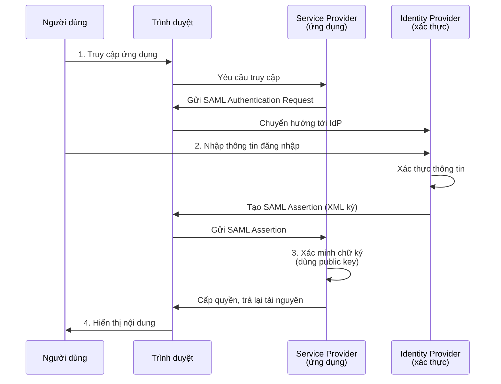
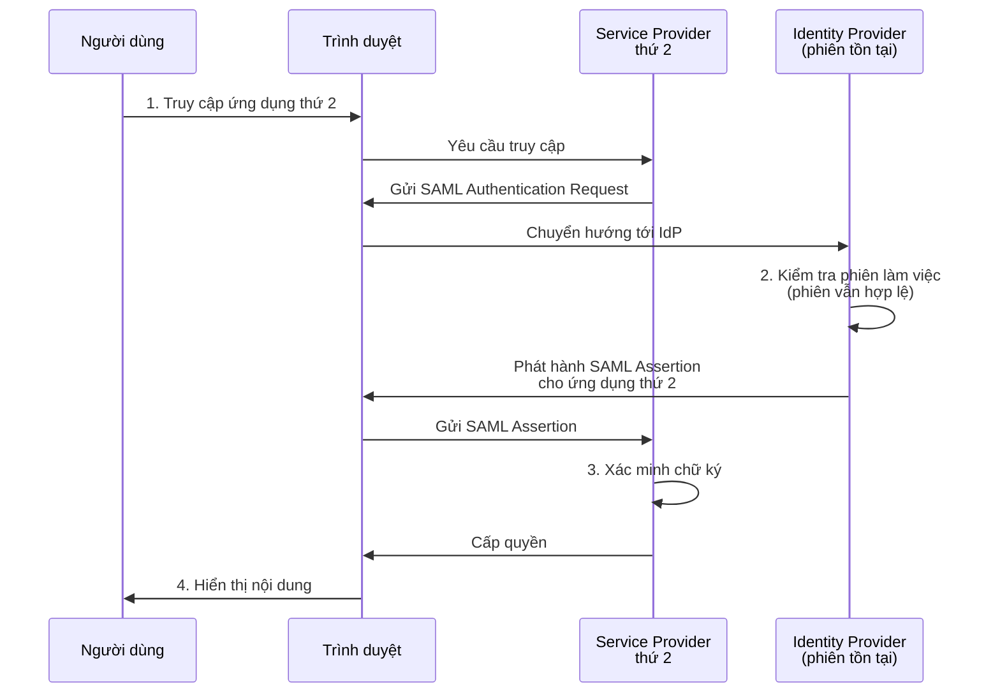

# [Vietnamese] Single Sign On

## Giới thiệu: Bối cảnh xác thực tập trung

Trong môi trường doanh nghiệp hiện đại, người dùng cần truy cập vào nhiều ứng dụng và dịch vụ khác nhau hàng ngày. Mỗi ứng dụng truyền thống yêu cầu người dùng nhập lại thông tin xác thực riêng, tạo ra trường hợp không hiệu quả và tăng nguy cơ bảo mật. Single Sign-On (SSO) giải quyết vấn đề này bằng cách cho phép người dùng xác thực một lần và sau đó truy cập được nhiều ứng dụng mà không cần đăng nhập lại. Bài viết này phân tích kiến trúc, giao thức, và luồng hoạt động của SSO từ góc độ phương pháp luận.

## Khái niệm cơ bản: SSO và Federated Identity

### Định nghĩa và mục đích

Single Sign-On là một mô hình xác thực cho phép người dùng sử dụng một bộ thông tin đăng nhập duy nhất để truy cập an toàn vào nhiều ứng dụng và dịch vụ độc lập. Thay vì duy trì các tài khoản riêng biệt trên mỗi nền tảng, SSO tập trung hoá quá trình xác thực thông qua một cơ chế xác minh duy nhất, giảm bớt gánh nặng cho người dùng và tăng cường quản lý danh tính toàn bộ hệ thống.

### Nền tảng: Federated Identity

SSO được xây dựng dựa trên khái niệm **Federated Identity** (danh tính liên kết). Mô hình này cho phép chia sẻ thông tin danh tính an toàn giữa các hệ thống độc lập nhưng có mối liên hệ tin cậy lẫn nhau. Thay vì mỗi ứng dụng quản lý cơ sở dữ liệu người dùng riêng, federated identity cho phép ủy quyền trách nhiệm xác thực cho một bên thứ ba đáng tin cậy, trong khi các ứng dụng khác chỉ cần xác minh tính hợp lệ của thông tin danh tính được cung cấp.

## Hai giao thức chính: SAML và OpenID Connect

### SAML – Tiêu chuẩn dựa trên XML

**SAML** (Security Assertion Markup Language) là một tiêu chuẩn mở dựa trên XML dùng để trao đổi thông tin danh tính giữa các dịch vụ. Được phát triển chủ yếu cho các môi trường doanh nghiệp, SAML hoạt động bằng cách tạo ra các khẳng định (assertions) – những tài liệu XML được ký mật mã – để xác minh rằng một người dùng đã được xác thực và có quyền truy cập những tài nguyên nào.

Ưu điểm của SAML nằm ở tính mạnh mẽ của nó trong các môi trường doanh nghiệp phức tạp, nơi cần quản lý quyền truy cập chi tiết. Tuy nhiên, cấu trúc dựa trên XML làm cho nó nặng nề hơn so với các giao thức khác, đặc biệt là trong các ứng dụng di động hoặc đòi hỏi độ lưu thông cao.

### OpenID Connect – Tiêu chuẩn dựa trên JWT

**OpenID Connect** là một lớp xác thực được xây dựng trên nền tảng OAuth 2.0, sử dụng JWT (JSON Web Token) thay vì XML để trao đổi thông tin danh tính. JWT là một tài liệu JSON được ký mật mã, nhỏ gọn hơn SAML assertions, làm cho nó phù hợp hơn cho các ứng dụng web hiện đại và các dịch vụ di động.

OpenID Connect đã trở nên phổ biến trong bối cảnh cá nhân và các nền tảng công cộng. Ví dụ, khi người dùng sử dụng tài khoản Google cá nhân để đăng nhập vào các ứng dụng như YouTube, họ đang sử dụng OpenID Connect. Giao thức này cung cấp mức độ tương tác cao hơn, phù hợp với kiến trúc vi dịch vụ (microservices) và các hệ thống phân tán.

### So sánh định dạng dữ liệu

Sự khác biệt cốt lõi giữa hai giao thức là định dạng của phần thông tin danh tính được trao đổi. SAML sử dụng XML làm định dạng cơ bản, trong khi OpenID Connect sử dụng JSON Web Token. Điều này ảnh hưởng trực tiếp đến kích thước payload, tốc độ xử lý, và sự tiện lợi trong quá trình tích hợp với các hệ thống khác nhau.

## Luồng xác thực SAML: Từ yêu cầu đến cấp quyền

### Kiến trúc tham gia chính

Để hiểu rõ cơ chế hoạt động của SAML, cần nắm vững ba vai trò chính trong hệ thống:

- **Service Provider (SP):** Là ứng dụng mà người dùng muốn truy cập, ví dụ như một dịch vụ email hoặc quản lý dự án. Service Provider không tự quản lý xác thực người dùng, mà thay vào đó phó thác công việc này cho Identity Provider.
- **Identity Provider (IdP):** Là dịch vụ chuyên trách xác thực người dùng. Nó duy trì cơ sở dữ liệu thông tin đăng nhập, xác thực thông tin này khi người dùng cung cấp, và phát hành khẳng định danh tính. Các ví dụ thực tế bao gồm các nền tảng xác thực doanh nghiệp được tổ chức cung cấp hoặc các dịch vụ xác thực của bên thứ ba.
- **User Agent (Trình duyệt):** Là công cụ mà người dùng sử dụng để giao tiếp với Service Provider và Identity Provider. Trình duyệt chuyển tiếp các yêu cầu xác thực và các khẳng định danh tính giữa hai bên.

### Luồng xác thực chi tiết

Sơ đồ dưới đây mô tả quy trình xác thực SAML từ đầu đến cuối:

#### Bước 1: Phát hiện lĩnh vực và gửi yêu cầu xác thực

Khi người dùng truy cập vào ứng dụng (Service Provider), máy chủ của ứng dụng phát hiện rằng người dùng đến từ một miền công ty (ví dụ, một địa chỉ email công ty). Service Provider nhận ra rằng cần xác thực người dùng thông qua một Identity Provider tập trung, do đó nó tạo ra một **SAML Authentication Request** và gửi lại cho trình duyệt. Yêu cầu này chứa thông tin về Service Provider nào yêu cầu xác thực và các yêu cầu cụ thể về mức độ bảo mật cần thiết.

#### Bước 2: Chuyển hướng tới Identity Provider

Trình duyệt tiếp nhận SAML Authentication Request từ Service Provider và chuyển hướng người dùng tới Identity Provider được chỉ định trong yêu cầu. Nếu người dùng chưa xác thực với Identity Provider, trang đăng nhập sẽ được hiển thị. Người dùng nhập thông tin xác thực của mình (tên người dùng và mật khẩu hoặc các yếu tố xác thực khác).

#### Bước 3: Phát hành SAML Assertion

Sau khi Identity Provider xác thực thông tin đăng nhập của người dùng, nó sẽ tạo ra một **SAML Assertion**. Đây là một tài liệu XML chứa các thông tin sau:

- Danh tính của người dùng (ví dụ, địa chỉ email, ID nhân viên)
- Thời gian phát hành và thời gian hết hạn của khẳng định
- Thông tin về những gì người dùng có quyền truy cập trên Service Provider cụ thể (thuộc tính quyền hạn)
- Chữ ký số của Identity Provider để chứng minh tính xác thực của tài liệu

SAML Assertion được ký mật mã bằng khóa bí mật của Identity Provider, bảo đảm rằng chỉ Identity Provider mới có thể phát hành những khẳng định hợp lệ. Khẳng định này được gửi trở lại trình duyệt.

#### Bước 4: Xác minh và cấp quyền

Trình duyệt chuyển tiếp SAML Assertion đã ký cho Service Provider. Service Provider sẽ **xác minh chữ ký** của khẳng định này bằng cách sử dụng khóa công khai của Identity Provider (được chia sẻ trước đó trong một quy trình thiết lập tin cậy). Nếu chữ ký hợp lệ, Service Provider tin tưởng rằng khẳng định thực sự đến từ Identity Provider.

Sau khi xác minh thành công, Service Provider đọc thông tin trong SAML Assertion, bao gồm danh tính người dùng và quyền hạn của họ. Dựa trên thông tin này, Service Provider cấp quyền truy cập cho người dùng vào những tài nguyên mà họ được phép truy cập, và trả lại nội dung được bảo vệ cho trình duyệt.

### Cơ chế lưu giữ trạng thái phiên làm việc

Quan trọng để lưu ý rằng, sau lần xác thực đầu tiên, Identity Provider lưu giữ trạng thái phiên làm việc của người dùng. Điều này cho phép một cơ chế gọi là **session caching** hoạt động: khi người dùng chuyển sang một ứng dụng SSO-integrated khác, Identity Provider không yêu cầu người dùng nhập lại thông tin đăng nhập, mà thay vào đó trực tiếp phát hành một SAML Assertion mới dành riêng cho ứng dụng khác.

## Truy cập nhiều ứng dụng: Tận dụng phiên làm việc hiện tại

### Kịch bản người dùng chuyển sang ứng dụng thứ hai

Giả sử sau khi xác thực thành công với ứng dụng đầu tiên, người dùng chuyển sang một ứng dụng SSO-integrated khác (ví dụ, từ dịch vụ email sang nền tảng quản lý dự án). Người dùng sẽ không được yêu cầu nhập lại thông tin đăng nhập. Thay vào đó, quy trình sau sẽ diễn ra:

Máy chủ của ứng dụng thứ hai phát hiện miền công ty của người dùng và gửi SAML Authentication Request tới Identity Provider. Tuy nhiên, vì Identity Provider vẫn giữ một phiên làm việc hợp lệ cho người dùng (được thiết lập từ lần xác thực trước), nó sẽ bỏ qua màn hình đăng nhập. Thay vào đó, Identity Provider trực tiếp tạo một SAML Assertion mới, nhưng lần này chứa thông tin cụ thể về quyền hạn của người dùng trên ứng dụng thứ hai.

SAML Assertion này được gửi trở lại trình duyệt, người dùng chuyển tiếp nó cho ứng dụng thứ hai. Ứng dụng thứ hai xác minh chữ ký (sử dụng cùng khóa công khai của Identity Provider mà nó đã được cấu hình) và cấp quyền truy cập. Kết quả là người dùng được đăng nhập vào ứng dụng thứ hai mà không cần nhập thông tin đăng nhập lần nữa.

### Lợi ích của cơ chế phiên làm việc

Cơ chế này mang lại hai lợi ích chính. Thứ nhất, nó giảm thiểu độ trễ (latency) – người dùng không cần chờ đợi xác thực lại vì Identity Provider chỉ cần tạo một khẳng định mới thay vì thực hiện toàn bộ quy trình xác thực. Thứ hai, nó cải thiện trải nghiệm người dùng bằng cách cung cấp truy cập liền mạch vào tất cả các ứng dụng được tích hợp SSO trong một khoảng thời gian được xác định.

## OpenID Connect: Một cách tiếp cận thay thế

### Cấu trúc và định dạng

OpenID Connect tuân theo cùng nguyên lý chung như SAML nhưng với những khác biệt cơ bản về cách triển khai. Thay vì trao đổi các khẳng định XML (SAML assertions), OpenID Connect sử dụng JWT (JSON Web Token). JWT là một tiêu chuẩn công khai cho việc tạo các tấu liệu truy cập được ký mật mã, được biểu diễn dưới dạng JSON thay vì XML.

Một JWT bao gồm ba phần: phần header (xác định thuật toán ký), phần payload (chứa thông tin danh tính), và phần signature (chữ ký mật mã). Do sử dụng JSON và cấu trúc nhỏ gọn hơn, JWT dễ dàng hơn để xử lý trong các ứng dụng web và di động.

### Luồng hoạt động tương tự nhưng với chi tiết khác

Luồng xác thực OpenID Connect cơ bản tương tự như SAML:

1. Người dùng truy cập Service Provider
2. Service Provider yêu cầu người dùng xác thực qua Identity Provider
3. Identity Provider xác thực người dùng
4. Identity Provider phát hành một JWT chứa thông tin danh tính
5. Service Provider xác minh JWT bằng khóa công khai của Identity Provider
6. Service Provider cấp quyền truy cập dựa trên thông tin trong JWT

Sự khác biệt không nằm ở quy trình tổng thể mà ở chi tiết kỹ thuật: định dạng trao đổi dữ liệu (JWT thay vì SAML Assertion), cách xây dựng thông tin quyền hạn, và khả năng tích hợp với các hệ thống hiện đại hơn.

### Phù hợp với các hệ thống hiện đại

OpenID Connect được thiết kế với các ứng dụng web hiện đại và kiến trúc vi dịch vụ trong tâm. JWT nhỏ gọn và tự chứa đựng (self-contained – tất cả thông tin cần thiết để xác minh danh tính đều nằm trong JWT), làm cho nó lý tưởng cho các hệ thống phân tán nơi các vi dịch vụ riêng lẻ cần xác minh danh tính của người dùng mà không cần phải gọi lại Identity Provider mỗi lần.

## Tiêu chí lựa chọn giữa SAML và OpenID Connect

### Môi trường doanh nghiệp: SAML

Trong các tổ chức doanh nghiệp lớn nơi quản lý danh tính tập trung đặc biệt quan trọng, SAML thường là lựa chọn ưu tiên. Các nền tảng quản lý danh tính doanh nghiệp (được cung cấp bởi các nhà cung cấp dịch vụ xác thực) đã tích hợp sâu rộng hỗ trợ cho SAML, và các cơ chế kiểm soát quyền truy cập chi tiết của SAML phù hợp với yêu cầu quản lý phức tạp của doanh nghiệp.

### Ứng dụng web hiện đại: OpenID Connect

Đối với các ứng dụng web mới hoặc các nền tảng công cộng, OpenID Connect cung cấp nhiều lợi ích. Các dịch vụ xác thực công khai như Google, Facebook, GitHub, và các nền tảng khác đã tích hợp mạnh mẽ hỗ trợ OpenID Connect. Nếu ứng dụng được xây dựng muốn cho phép người dùng đăng nhập bằng các tài khoản công khai này, OpenID Connect là lựa chọn tự nhiên.

### Tiêu chí quyết định chính

Quyết định cuối cùng giữa SAML và OpenID Connect không phải dựa trên tính bảo mật (cả hai đều được thiết kế an toàn và được sử dụng rộng rãi), mà dựa trên **tính khả dụng của tích hợp** với các hệ thống và nền tảng cụ thể. Nếu Service Provider cần tích hợp với một nền tảng quản lý danh tính doanh nghiệp, cần kiểm tra xem nền tảng đó hỗ trợ giao thức nào tốt nhất. Tương tự, nếu muốn cho phép đăng nhập thông qua các tài khoản công khai (như Google hoặc GitHub), OpenID Connect sẽ là lựa chọn rõ ràng vì những nền tảng này cung cấp hỗ trợ tốt nhất cho giao thức này.

## Kết luận: Framework bảo mật thông qua tập trung hóa xác thực

Single Sign-On đại diện cho một sự thay đổi cơ bản trong cách tiếp cận xác thực người dùng trong các hệ thống phân tán. Bằng cách tập trung hóa trách nhiệm xác thực thông qua một Identity Provider, SSO không chỉ giảm bớt gánh nặng trên người dùng mà còn tăng cường bảo mật toàn hệ thống. Mô hình Federated Identity cho phép các tổ chức chia sẻ thông tin danh tính một cách an toàn giữa các ứng dụng độc lập nhưng có liên kết tin cậy.

Hai giao thức chính, SAML và OpenID Connect, cung cấp các cách triển khai khác nhau của cùng nguyên lý. SAML, với cơ sở hạ tầng dựa trên XML, phục vụ tốt nhất cho các môi trường doanh nghiệp phức tạp đòi hỏi quản lý quyền hạn chi tiết. OpenID Connect, sử dụng JWT, cung cấp tính linh hoạt và dễ tích hợp cho các ứng dụng web hiện đại và các hệ thống micro-service.

Việc lựa chọn giao thức phù hợp không phải vấn đề của tính bảo mật tuyệt đối mà là vấn đề của sự phù hợp với kiến trúc hệ thống hiện có và khả năng tích hợp với các nền tảng đã được lựa chọn. Các tổ chức hiện đại thường tìm kiếm các nền tảng quản lý danh tính linh hoạt có thể hỗ trợ cả hai giao thức, cho phép họ áp dụng cách tiếp cận phù hợp nhất cho từng trường hợp sử dụng cụ thể.
