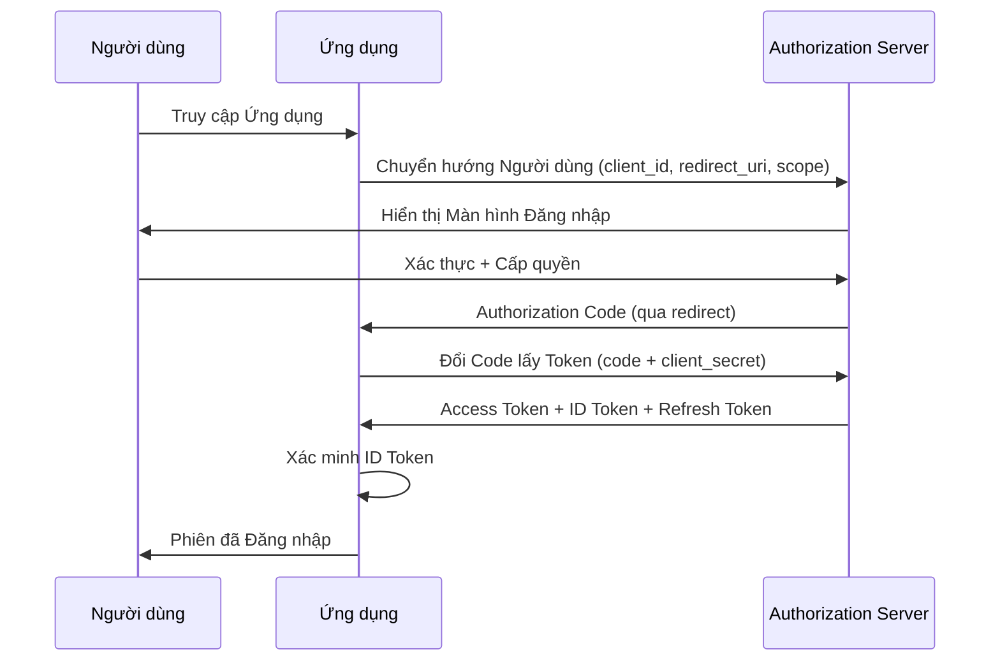

# OAuth 2.0 and OpenID Connect In Depth

OAuth 2.0 is an authorization framework that allows third-party applications to access protected resources without needing the user's credentials. It solves a fundamental problem: how can an application access a user's data on another service without the user sharing their password? OpenID Connect builds on top of OAuth 2.0 to add an identity layer — not only authorizing access, but also verifying the user's identity.

## OAuth 2.0 Flows

### Authorization Code Flow

The Authorization Code flow is the most secure OAuth 2.0 flow for applications with a backend server. The process begins when the user is redirected to the authorization server. The user authenticates and grants permission to the application. The authorization server redirects the user back to the application with an authorization code — a temporary, single-use code.

The application sends this authorization code — along with the client secret — to the authorization server's token endpoint over a back-channel. The authorization server verifies the code and client secret, and returns an access token and refresh token. Critically, the access token never passes through the browser — only the short-lived authorization code travels over the front-channel, and the code-for-token exchange happens over the secure back-channel.

### PKCE (Proof Key for Code Exchange)

PKCE is an extension to the Authorization Code flow designed for applications without a client secret — such as single-page applications and mobile apps. The problem: without a client secret, how to ensure that the application exchanging the authorization code for a token is the same application that requested that code?

PKCE solves this by requiring the application to generate a code verifier — a random string — and send the code challenge (SHA-256 hash of the verifier) in the authorization request. When exchanging the code for a token, the application sends the original code verifier. The authorization server verifies that the verifier matches the challenge. An attacker intercepting the authorization code cannot exchange it for a token because they do not know the code verifier.

### Client Credentials Flow

The Client Credentials flow is used for machine-to-machine communication, where there is no end user. The application sends its client ID and client secret directly to the token endpoint and receives an access token. There is no user redirect step, no authorization code. This is the simplest flow and is suitable for backend services communicating with each other.

## OpenID Connect

OpenID Connect adds an additional token — the ID token — to the OAuth 2.0 token response. The ID token is a JWT containing claims about the user: sub (unique identifier), iss (issuer), aud (audience — the application's client ID), exp (expiration time), iat (issued-at time). The ID token is signed by the authorization server, allowing the application to verify the user's identity without calling back to the authorization server.

The UserInfo endpoint provides additional claims about the user — name, email, profile picture — via an API protected by the access token. The application can retrieve this information after obtaining an access token.

## Token Security

Access tokens should have a short lifetime — 5 to 15 minutes. Refresh tokens have a longer lifetime — hours to days — but can be revoked. Refresh token rotation: each time a refresh token is used, the authorization server issues a new refresh token and invalidates the old one. If a refresh token is stolen and used after it has been rotated, the authorization server detects the reuse event and revokes all tokens for that user.

Sender-constrained tokens bind a token to a specific client via mTLS or DPoP (Demonstration of Proof-of-Possession). Even if a token is stolen, the attacker cannot use it because they cannot prove possession of the corresponding private key.

## Design Principles

OAuth 2.0 and OpenID Connect rest on three principles. First, no passwords are shared — the application never sees the user's password. Second, short-lived tokens — access tokens expire quickly, refresh tokens can be revoked. Third, minimal access scope — applications only request the scopes they need, and users can see and approve them.
