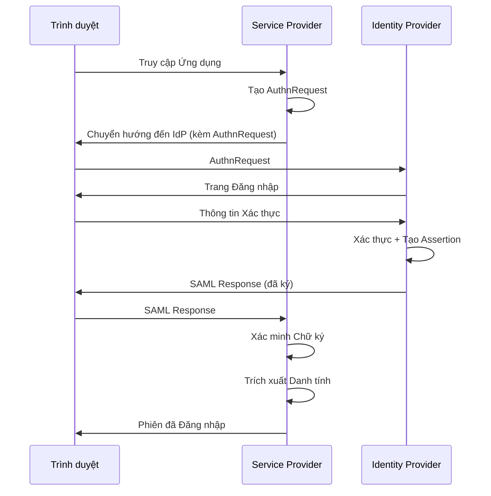

# SAML 2.0 in the Enterprise

Security Assertion Markup Language 2.0 is an XML standard for exchanging authentication and authorization data between parties, particularly between an identity provider and a service provider. Although OpenID Connect is gradually replacing SAML for new applications, SAML remains the backbone of enterprise authentication — integrating with Active Directory, legacy SaaS applications, and internal identity infrastructure.

## SAML Authentication Flow

The typical SAML flow begins when a user attempts to access a service provider. The SP detects that the user is not authenticated and generates a SAML Authentication Request — an XML document containing a request ID, response URL, and other parameters. The SP redirects the user's browser to the IdP, carrying the Authentication Request.

The IdP receives the request, authenticates the user — via credentials, MFA, or an existing session — and generates a SAML Response. The Response contains an Assertion — a statement about the user's identity — signed with the IdP's private key. The Assertion includes: Subject (user identifier), Conditions (validity period, audience restriction), and Attribute Statement (user attributes — email, name, role, groups).

The user's browser forwards the SAML Response to the SP. The SP verifies the signature using the IdP's public key, checks the conditions (time, audience), extracts the user identity, and creates a local session.

## Integration Configuration

Metadata exchange is the first step in SAML integration. The IdP and SP exchange XML metadata containing: entity ID (unique identifier), certificate (for signature verification), and endpoint URLs (where to send requests and responses). Metadata is typically exchanged via URLs — each party provides a metadata URL that the other party downloads and imports.

Attribute mapping defines how user attributes from the IdP are mapped to attributes in the SP. The IdP may send `email`, `firstName`, `lastName`, `groups`. The SP needs to know which attribute names correspond to which fields in its application. This mapping is typically configured within the SP.

## SAML Security

XML signatures are the primary security mechanism. The IdP signs the Assertion — and optionally the entire Response — with its private key. The SP verifies the signature using the public key from metadata. If the signature is invalid, the Response is rejected. This prevents attackers from forging Assertions.

Encryption protects the Assertion from being read by third parties. The Assertion is encrypted with the SP's public key, ensuring that only the SP — with the corresponding private key — can decrypt it. Encryption is optional but recommended when the Assertion contains sensitive information.

Replay prevention: each Authentication Request has a unique ID. The SP tracks used IDs and rejects any Response with a duplicate ID. This prevents an attacker from replaying an old Response.

## Design Principles

SAML in the enterprise rests on three principles. First, metadata is the source of truth — every integration configuration starts with accurate metadata. Second, signatures are mandatory — never accept unsigned Assertions. Third, certificates have expiration — the IdP's certificate will expire, and the certificate rotation process must be planned ahead.
