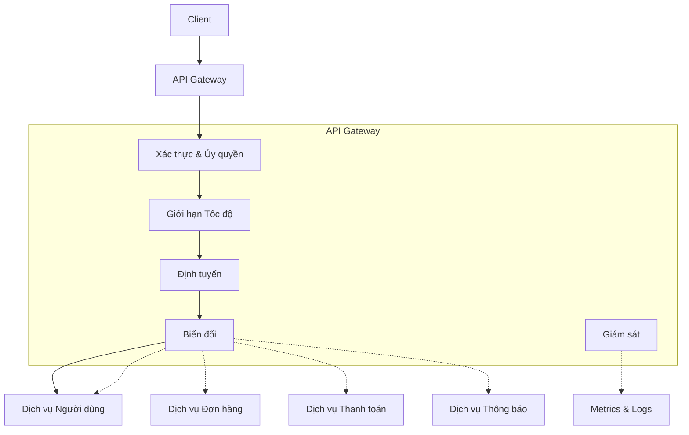

# API Gateway Architecture

The API Gateway is the single entry point for all requests from clients to the backend system. It is not just a reverse proxy — it is an architectural layer that provides cross-cutting concerns such as authentication, rate limiting, routing, request transformation, and response aggregation. When designed correctly, the API Gateway simplifies backend architecture by centralizing concerns that every service would otherwise have to handle on its own.

## API Gateway Responsibilities

Authentication and authorization are the first and most important responsibility. The API Gateway verifies the caller's identity — through tokens, certificates, or API keys — and determines whether they are authorized to perform the request. By centralizing authentication at the gateway, backend services can assume that every incoming request has already been authenticated, simplifying their security logic.

Rate limiting protects the backend from overload. The gateway tracks the number of requests from each client — identified by IP address, API key, or user token — and rejects requests that exceed the threshold. Common rate limiting algorithms include token bucket (allowing short-term bursts), sliding window (limiting within a sliding time interval), and leaky bucket (processing at a fixed rate).

Request routing directs requests to the appropriate backend service based on URL path, HTTP headers, or request body. This allows the backend architecture to evolve independently of the API interface that clients see — a service can be split into two, or two services can be merged, without changing the public API.

Request and response transformation allows the gateway to adjust data formats between client and backend. Adding or removing HTTP headers, converting between serialization formats, or enriching requests with contextual information — such as the user ID extracted from the authentication token.

## Gateway Aggregation Pattern

An API endpoint may require data from multiple backend services. Instead of forcing the client to make multiple requests and combine results itself, gateway aggregation makes backend calls in parallel and aggregates the responses into a single response for the client.

This is particularly useful for mobile applications or single-page applications, where each network request has costs in battery and bandwidth. However, aggregation increases gateway complexity and creates a central point of failure — if the gateway cannot complete aggregation, the entire request fails. Circuit breakers and timeouts must be applied to each individual backend call within the aggregation.

## Backend for Frontend Pattern

Backend for Frontend is a variant of the API Gateway where each client type — web browser, mobile application, IoT device — has its own gateway optimized for that client's specific needs. A BFF for web browsers might aggregate data from multiple services to render a complete page. A BFF for mobile applications might optimize response size and number of requests. A BFF for IoT devices might handle lightweight protocols like MQTT.

BFF solves the one-size-fits-all problem of traditional API Gateways, but at the cost of maintaining multiple gateways. Each BFF is a separate service, owned by the corresponding client development team, allowing them to develop and deploy independently.

## Design Principles

API Gateway design relies on three principles. First, the gateway should be stateless — all session state should be stored in the backend or in client tokens, not in the gateway. A stateless gateway can be replicated and scaled horizontally without synchronization. Second, the gateway should be transparent to business logic — it handles cross-cutting concerns but should not contain business logic. Business logic in the gateway creates tight coupling and erodes service boundaries. Third, the gateway is a point of failure — it must be designed for high availability, with multiple instances, health checks, and automatic failover.
