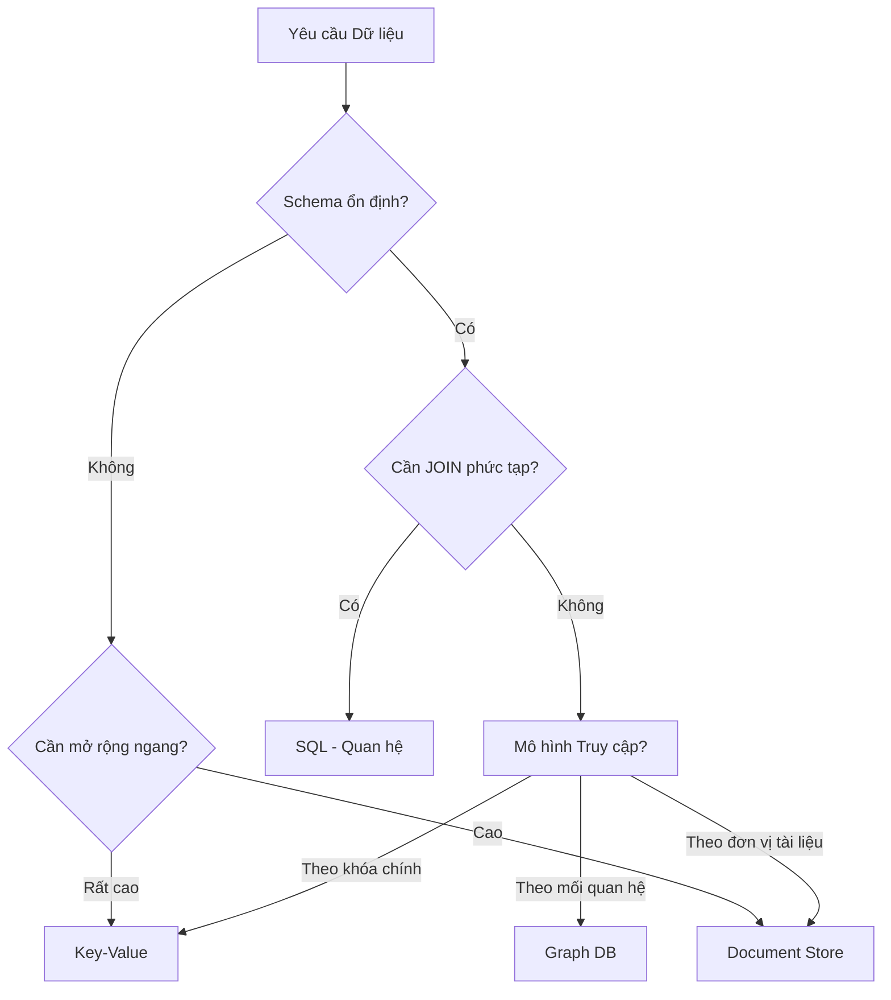

# SQL and NoSQL Decision Framework

Choosing between relational and non-relational databases is one of the architectural decisions with the highest migration cost. Unlike changing a library or framework, migrating data between database models requires schema redesign, query rewriting, data migration, and often downtime. This decision should be made based on thorough analysis of data access patterns, consistency requirements, and data models — not on technology trends.

## The Database Spectrum

Relational databases organize data into tables with predefined schemas, ensuring integrity through primary keys, foreign keys, and constraints. They provide ACID transactions — atomicity, consistency, isolation, durability — and the powerful SQL query language for complex queries spanning multiple tables. They are suitable when data structure is known in advance and stable, when relationships between entities are important, and when consistency is a non-negotiable requirement.

Document databases store data as documents with flexible structures — typically JSON or BSON — without requiring a fixed schema. Each document can have a different structure. They are suitable when data structure changes over time, when data is accessed as an atomic unit (no joins needed), and when the data model is hierarchical or nested.

Key-value databases store data as simple key-value pairs, with very low latency and linear scalability. They are suitable for caching, session storage, and simple access patterns where every query retrieves a single item by primary key.

Graph databases store data as nodes and edges, optimized for relationship queries — such as "find all friends of friends who purchased this product." They are suitable for social networks, recommendation systems, and fraud detection.

## Selection Criteria

Data access pattern is the most important criterion. If the application primarily reads and writes entire objects — such as user profiles, documents, or configurations — a document database is a natural fit. If the application performs complex queries involving multiple entities — such as financial reports, analytics, or aggregations — a relational database with SQL is the right tool.

Consistency requirements are the second criterion. If the application requires strong consistency — bank account balances must always be accurate, never showing stale balances — a relational database with ACID transactions is the safest choice. If the application can accept eventual consistency — the "like" count on a post can be slightly outdated for a few seconds — a non-relational database with higher availability is appropriate.

Scalability is the third criterion. Relational databases scale vertically — adding CPU, RAM, disk to a single server — which comes with hardware limits. Non-relational databases are designed to scale horizontally — adding more nodes to a cluster — with near-linear scalability. If the application needs to handle terabytes of data or millions of requests per second, horizontal scaling is the only practical path.

## Selection Principles

Choosing a database model relies on three principles. First, start with the data model, not the technology — understand data structure, relationships, and access patterns before choosing a database. Second, consciously trade off consistency for scalability — no database provides both at maximum levels, and the choice must reflect the application's actual requirements. Third, database diversification is acceptable — use a relational database for transactional data, a document database for content, a key-value database for caching — each data type uses the tool optimized for it.
