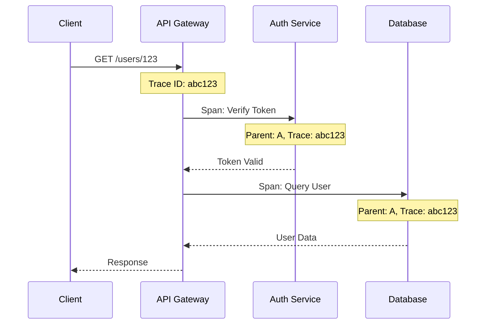

# Distributed Tracing in Distributed Systems

When a request passes through dozens of microservices, understanding what happened — and why it was slow — becomes nearly impossible without distributed tracing. Tracing records the entire journey of a request across service boundaries, with each step represented as a span — a unit of work with a start time, end time, metadata, and parent-child relationship with other spans. The collection of spans for a single request forms a trace.

## Core Concepts

A trace represents the entire end-to-end journey of a request. It is identified by a unique trace ID generated at the system's entry point and propagated through all downstream services. Every component processing the request uses the same trace ID, enabling correlation of all related activities.

A span represents a single unit of work within a trace — an API call, a database query, or an internal operation. Each span has its own span ID, a reference to the trace ID, and optionally a reference to the parent span ID (the span that called this span). Spans can contain tags (key-value metadata) and events (labeled timestamps within the span).

Context propagation is the mechanism for passing trace ID and span ID across service boundaries. When Service A calls Service B, it includes the trace context in the request header — typically the `traceparent` header per the W3C Trace Context standard. Service B extracts this context and creates child spans. Without context propagation, each service would create its own trace and they could not be correlated.

## Sampling

In high-traffic systems, recording every trace is impractical — the data volume would be overwhelming. Sampling determines which traces are recorded and which are discarded.

Head-based sampling decides at the entry point — the trace ID is checked, and if it falls within the sampling range, the entire trace is recorded. This is simple but problematic: if you sample 1 percent of requests, you will miss 99 percent of traces containing errors or high latency.

Tail-based sampling decides after the trace completes — all spans are collected in a buffer, and the sampling decision is based on the properties of the entire trace. Traces containing errors or exceeding latency thresholds are kept; fast-successful traces can be discarded. This requires more resources but ensures you do not miss interesting traces.

## Analysis and Debugging

Search traces by attributes: "show all traces with errors in the last 30 minutes" or "show traces for user_id=456". This enables rapid problem scoping without manually browsing through logs.

Critical path analysis: identify the longest path through a trace — the chain of sequentially dependent spans that determines the total response time. Optimizing any span that is not on the critical path does not improve overall response time.

Trace comparison: compare successful and failed traces for the same endpoint to identify what differs. Did the failed trace call a service the successful trace did not? Did the slow trace have an unusually long database span?

## Design Principles

Distributed tracing is based on three principles. First, context propagation is mandatory — every service in the chain must propagate trace context, otherwise the trace breaks. Second, sampling should prioritize interesting traces — errors and high latency are more important than fast successes. Third, trace IDs should appear in logs — correlating traces and logs lets you jump from seeing a slow span to reading the logs from that service.
