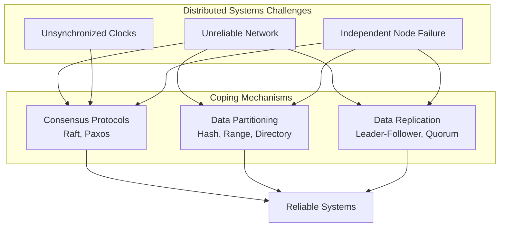

# Systems Design

Every software system starts simple. Then it gets users. Then it gets more users. The database cannot keep up, the API starts timing out, one service failure cascades into the entire platform going down, and suddenly you are debugging distributed consensus protocols at three in the morning. Systems design is the discipline of anticipating these problems before they occur — and building architectures that handle them gracefully when they do.

## The Essence of Systems Design

Systems design is the process of defining the architecture, components, modules, interfaces, and data flows of a system to meet specific requirements. It differs from writing code the way architecture differs from construction: it is about the big decisions that determine reliability, scalability, maintainability, and performance.

A systems designer thinks in three directions. Failure modes — what happens when a server dies, when the network partitions, when a third-party API goes down? The system must degrade in a controlled manner, not collapse catastrophically. Trade-offs — there is no "best" architecture; every choice trades one thing for another: consistency for availability, simplicity for scalability, latency for throughput. The skill is knowing which trade-offs matter for the specific context. Evolution — production systems are never greenfield; they live alongside legacy code, existing infrastructure, and organizational constraints.

## Core Knowledge Pillars

### Distributed Systems

This is the foundation of modern architecture. A distributed system is any system where components on networked computers communicate and coordinate through message passing. The core challenge: you cannot trust anything. Networks are unreliable — messages are delayed, lost, duplicated, or reordered. Clocks are unsynchronized — each machine has its own clock and they drift apart. Nodes fail independently — partial failures are the norm, not the exception. Consensus protocols enable distributed nodes to agree on state. Partitioning strategies divide data across machines. Replication mechanisms keep data available when individual nodes fail.

### API Design

APIs are the user interface for developers. A well-designed API makes the right thing easy and the wrong thing hard — guiding consumers toward correct usage through intentional structure. Three protocol paradigms dominate: REST with its resource model and HTTP methods; GraphQL with flexible client-defined queries; and gRPC with high performance and strict schema definitions. Protocol selection depends on the API consumer, data shape, and communication pattern. Universal principles — consistency, error handling, versioning, pagination — apply regardless of the chosen protocol.

### Event-Driven Architecture

In a synchronous system, Service A calls Service B and waits for a response. If B is slow, A is slow. If B is down, A fails. Scale this to dozens of services and you have built a distributed monolith. Event-driven architecture breaks this coupling by replacing direct calls with asynchronous events. A service publishes an event when something noteworthy occurs. Other services subscribe to events they care about. The publisher does not know who is consuming. The consumer does not know who published.

Distributed streaming platforms provide the backbone for this architecture with durable storage and event replay. Traditional message queues optimize for reliable delivery with complex routing patterns. Saga patterns solve the problem of data consistency across service boundaries through compensating transactions.

### Databases and Storage

Choosing a data model — relational, document, key-value, graph, time-series — is one of the architectural decisions with the highest migration cost. Each model is optimized for a specific class of queries and access patterns. Optimization techniques include indexing strategies, connection pooling, read/write splitting, materialized views, and partitioning. Schema migration in production environments — with zero downtime — requires patterns such as expand-contract and blue-green schema deployments.

### Reliability and Resilience

Systems will fail. The question is not "if" but "when" and "what happens next." Circuit breakers prevent failure propagation by automatically disconnecting from failing services. Retry with backoff and jitter avoids retry avalanche. The bulkhead pattern isolates resources so a failure in one part of the system does not bring down everything. Health checks — liveness, readiness, startup probes — enable orchestration platforms to automatically detect and replace unhealthy instances. Graceful shutdown ensures in-flight requests complete before the process terminates.

## Core Principles

Systems design rests on three foundational principles. First, failure is inevitable — every design must start from the question "what will fail" rather than "how do we make it work." Mechanisms such as circuit breakers, retry budgets, fallbacks, and graceful degradation are not optional features but architectural requirements. Second, simplicity is scalability — the more complex a system, the harder it is to debug when it fails. Every added component must be justified by a specific need, not by predictions about the future. Third, data is the boundary — every architecture ultimately revolves around where data lives, who owns it, and how to keep it consistent when everything else fails.
