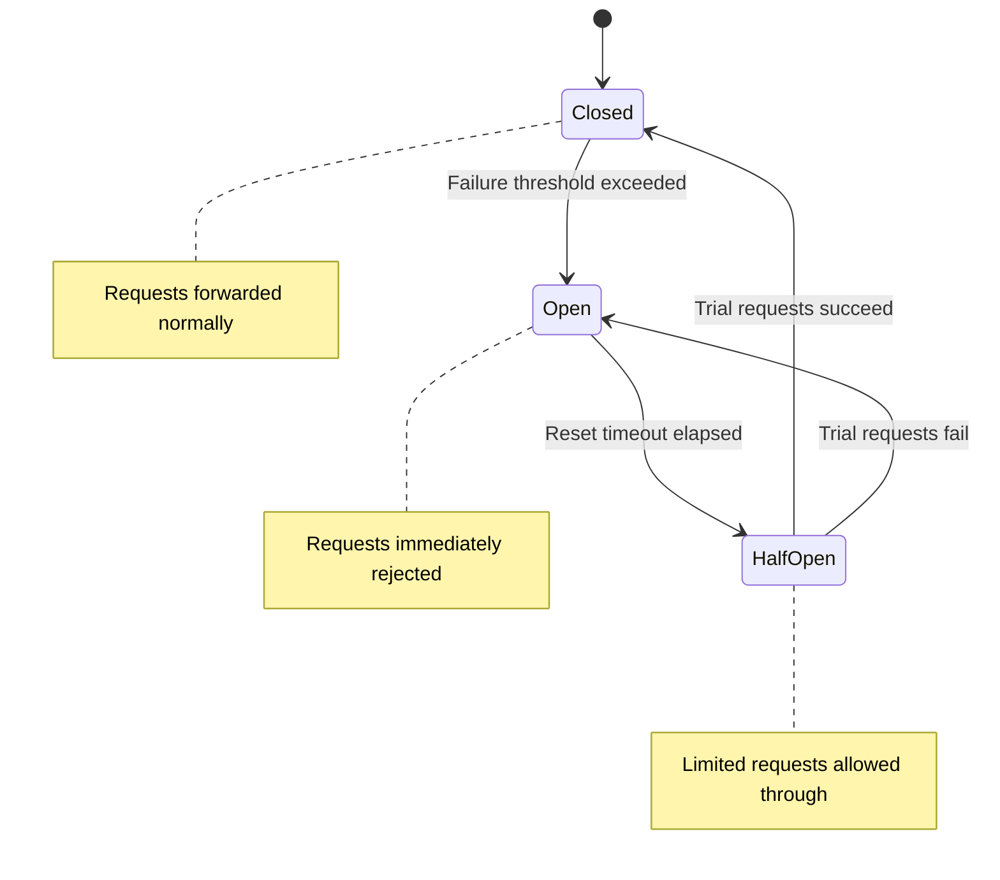

# Circuit Breaker and Bulkhead in Distributed Systems

In a distributed system, the failure of one service can cascade rapidly. Service A calls Service B. B is slow due to overload. A holds connections open, waiting for responses. New requests arriving at A continue calling B. A's thread pool is exhausted. A begins timing out. Services calling A also begin timing out. The failure propagates like a tsunami through the entire architecture. Circuit breaker and bulkhead are two design patterns that prevent this propagation.

## Circuit Breaker

A circuit breaker is a design pattern that automatically cuts off connections to a failing service, giving it time to recover while protecting calling services from cascading failure. The pattern is inspired by electrical circuit breakers in electrical engineering: when current is too high, the breaker opens the circuit to protect the system.

A circuit breaker has three states. In the closed state, requests are forwarded normally to the target service, and a failure counter is maintained. When the number of failures within a time window exceeds the threshold, the circuit breaker transitions to the open state. In the open state, all requests are immediately rejected without calling the target service — typically returning an error or a predefined fallback response. After a reset timeout period, the circuit breaker transitions to the half-open state, where a limited number of requests are allowed through to test whether the target service has recovered. If the trial requests succeed, the circuit breaker returns to the closed state. If they fail, it returns to the open state.

Key configuration parameters include: failure threshold (number of consecutive failures or failure rate within a time window), reset timeout (how long the circuit breaker stays open before transitioning to half-open), and the number of trial requests in the half-open state. These parameters should be tuned based on the characteristics of the target service: fast-recovering services can have short reset timeouts, while services with long startup times need longer reset timeouts.

## Bulkhead

A bulkhead is a design pattern that isolates resources so that failure in one part of the system does not exhaust resources across the entire system. The name comes from the compartmentalized walls in a ship's hull: if one compartment is breached, water only floods that compartment, not the others, and the ship stays afloat.

In software systems, bulkheads are implemented through resource partitioning. Separate thread pools for different types of requests: one pool for user requests, one pool for internal requests, one pool for batch requests. If batch requests consume all the threads in their pool, user requests are still processed normally. Separate connection pools for different databases: one pool for the primary database, one pool for the analytics database. If analytics queries consume all connections, the main application can still access its database.

Bulkheads can also be implemented at the service level. Instead of one monolith service handling all request types, multiple independent service instances, each handling a specific request type. A failure in payment processing logic does not affect the ability to display products.

## Combining Circuit Breaker and Bulkhead

These two design patterns complement each other. The circuit breaker prevents calling a failing service. The bulkhead prevents failure in one part of the system from spreading to other parts. Combine both: each bulkhead has its own circuit breaker, configured with thresholds appropriate to the characteristics of the service in that bulkhead. The payment service may have a more sensitive circuit breaker (lower failure threshold) than the product recommendation service, because payment failures have more severe impact.

## Design Principles

Designing for resilience rests on three principles. First, failure is inevitable — every call to an external service can fail, and the system must be designed to handle that failure gracefully. Second, resource isolation is the primary defense — when resources are partitioned, failures are contained within one partition rather than spreading across the entire system. Third, fallbacks should be predefined — every service call should have a fallback strategy: return cached data, return a default value, or return a degraded response. No fallback should be invented in the heat of an emergency.
