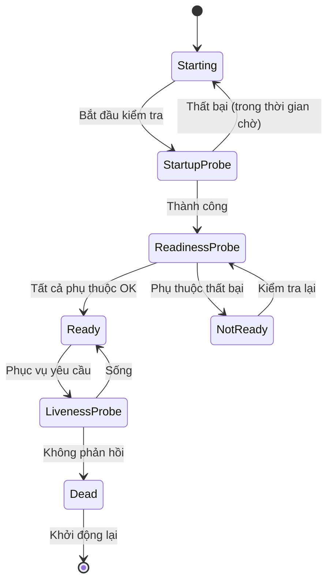

# Health Checks and Graceful Shutdown

In production environments, the orchestration platform's ability to automatically detect and handle unhealthy instances is the deciding factor between an incident resolved automatically in seconds and one that wakes up the on-call engineer at 3 a.m. Health checks and graceful shutdown are the two platform mechanisms that enable this automation.

## Three Types of Health Checks

### Liveness Probe

The liveness probe answers the question: is the application running? A failed liveness probe means the application is stuck — deadlock, infinite loop, or crash — and needs to be restarted. The orchestration platform will automatically kill the container or process and start a new instance.

The liveness probe should check the most minimal condition possible — typically just "process is alive" or "event loop is responding." It should not check external dependencies like databases or remote APIs, as a dependency failure would trigger mass restarts — worsening the situation.

### Readiness Probe

The readiness probe answers the question: is the application ready to serve requests? A failed readiness probe means the application is running but not ready — initializing database connections, loading caches, or in the startup process. The orchestration platform will stop sending traffic to that instance but will not kill it.

The readiness probe should check all dependencies necessary to serve requests. If the database is unavailable, the readiness probe fails — the instance stays alive but does not receive traffic until the database recovers.

### Startup Probe

The startup probe solves the problem of slow startup. Some applications need significant time to initialize — loading machine learning models, building caches, or establishing connections. If the liveness probe runs too early, it will kill the application before it finishes starting up.

The startup probe runs during the startup phase with its own time threshold and frequency. Once the startup probe succeeds for the first time, it stops running and the liveness probe takes over. This allows for strict liveness probe configuration without worrying about the application being killed during startup.

## Graceful Shutdown

When the orchestration platform decides to stop an instance — due to scaling down, rolling update, or node migration — it sends a SIGTERM signal. Graceful shutdown is the process by which the instance handles this signal in an orderly manner: stop accepting new requests, complete in-flight requests, close database connections, and exit.

The steps of graceful shutdown:

1. Receive the SIGTERM signal from the orchestration platform.
2. Readiness probe starts returning failure — the orchestration platform stops sending new requests to this instance.
3. Wait for a period — typically 5 to 15 seconds — for in-flight requests to complete.
4. Close all connections — databases, message queues, caches — in an orderly manner.
5. Log a final entry and exit with code 0.

If the process does not exit within the specified period — typically 30 seconds — the orchestration platform sends SIGKILL, forcing the process to stop immediately. This can lead to interrupted requests, leaked connections, and inconsistent data. Graceful shutdown is designed to avoid SIGKILL by completing cleanup within the allowed time.

## Design Principles

Health checks and graceful shutdown rely on three principles. First, clearly distinguish between "alive," "ready," and "starting" — each state has its own check mechanism and remediation action. Second, health checks must be lightweight and fast — they run frequently, and each check consumes resources. A health check that takes 5 seconds to complete causes more problems than it solves. Third, every application must support graceful shutdown — no exceptions. An application that cannot stop in an orderly manner is not ready for production environments.
